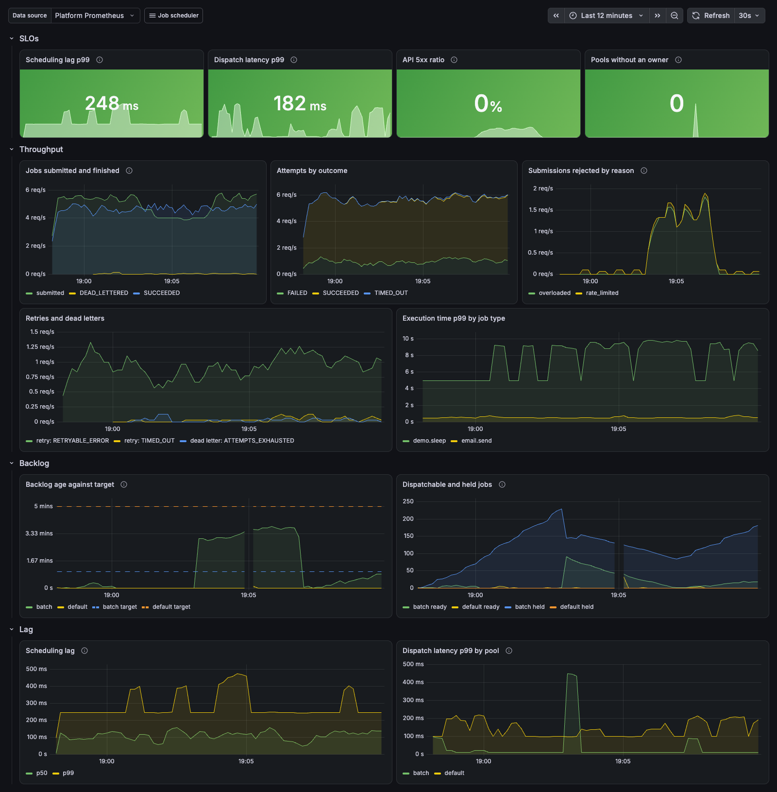
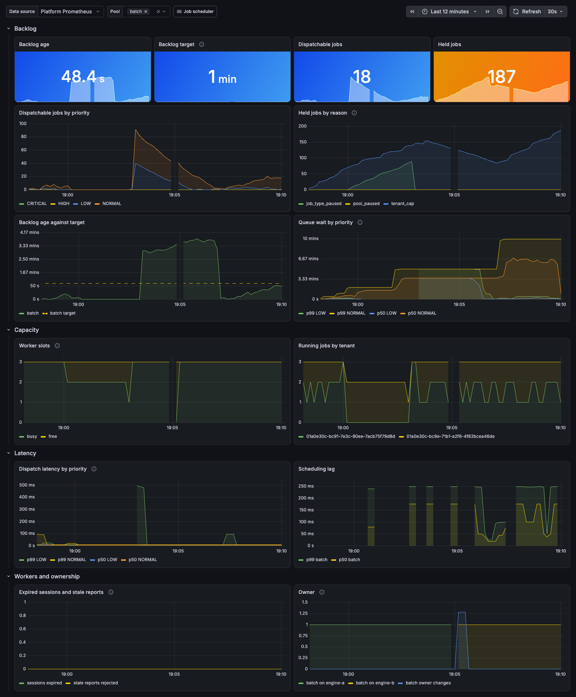
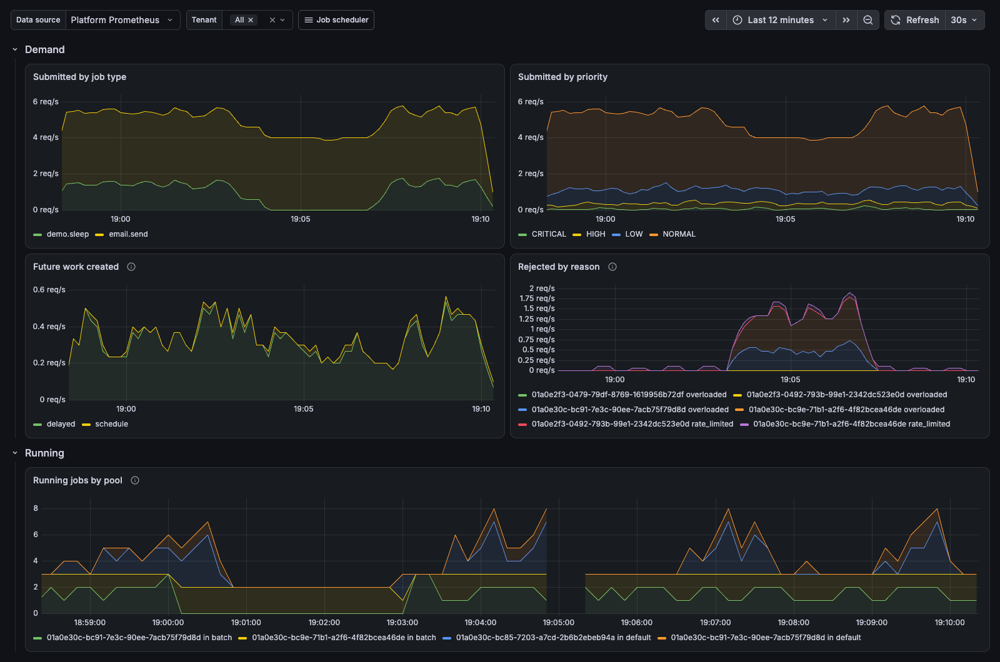
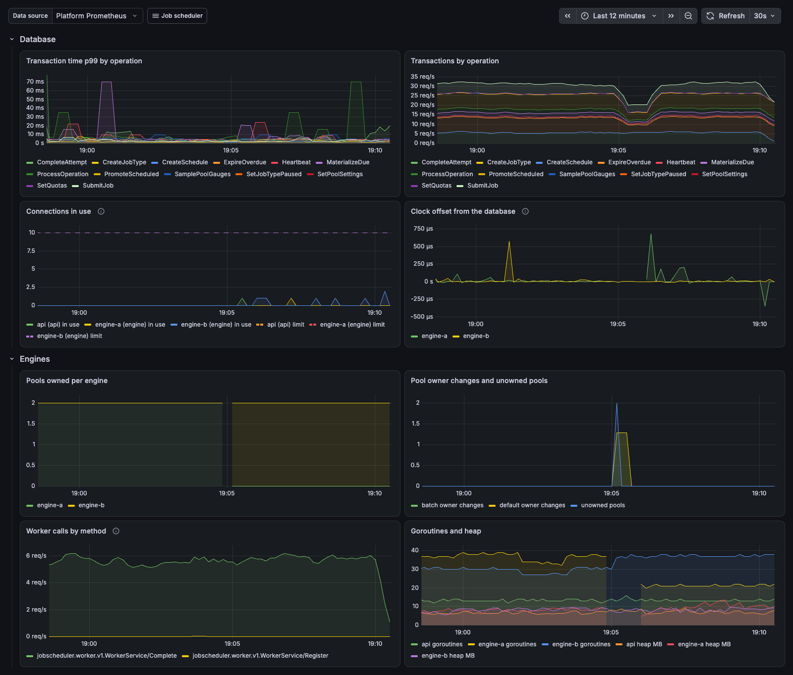

# Distributed Job Scheduler

A distributed job scheduling and execution platform: durable jobs that run now, later or on a recurring schedule, with at-least-once execution, retries, priorities and fair sharing across tenants, on a horizontally scalable worker fleet.

**Status:** phases 0–14 of the [implementation plan](docs/implementation-plan.md) are done. Phase 13's AWS environment is built and validated in CI, and creating it needs an AWS account. The work covers: scaffolding, domain core, persistence, the REST API ([OpenAPI](api/openapi.yaml)), the scheduler (cron with time zones and DST, fixed-rate, fixed-delay, misfire and overlap policies), coordination (epoch-fenced leases with self-fencing) and the worker system (gRPC [protocol](proto/jobscheduler/worker/v1/worker.proto), dispatcher with weighted priorities and tenant caps, [Go SDK](pkg/workersdk), demo worker), recovery (reaper with warm-up, engine-side timeouts, retention and partition maintenance, bulk cancel and re-drive), observability (Prometheus metrics, OpenTelemetry traces linked from submission to execution, alert rules), security hardening (per-pool worker tokens, API key rotation, TLS, a least-privilege database role, a route-wide tenant-isolation test, vulnerability and image scanning), and failure testing (a fault-injection suite covering HLD scenarios S1–S14; workers ride out database failovers without losing running jobs), deployment (Terraform for ECS on Fargate with RDS, a manual deploy workflow, runbooks for every alert), and load testing (tier M scenarios and the tuning they led to). Every V1 functional requirement is implemented. That includes platform administration (worker drain, pool and job-type pause), tenant quotas with priority-aware load shedding, and payload JSON Schemas.

## Documentation

| Document | Contents |
|---|---|
| [High-level design](docs/architecture.md) | Requirements, architecture, failure scenarios, deployment |
| [Low-level design](docs/low-level-design.md) | Code structure, state machines, algorithms (grows each phase) |
| [Decision records](docs/decisions/) | ADR-001 to ADR-033, one decision per file |
| [Runbooks](docs/runbooks/) | One per alert, plus rollback, failover drill, restore and credential rotation |
| [Implementation plan](docs/implementation-plan.md) | Phases, exit criteria, status |

## Quick start

Requires Go 1.26+. Integration tests start an embedded PostgreSQL automatically (downloaded once); `go test -short ./...` skips them. Docker is only needed for `docker compose`.

```sh
make lint test-race   # formatting, vet, all tests with the race detector
make build            # bin/jobscheduler
docker compose up     # PostgreSQL, migrations, the platform (api + engine roles), Prometheus, Grafana
curl localhost:9090/readyz
curl localhost:9090/metrics
```

To run against an existing PostgreSQL instead: `JS_DATABASE_URL=postgres://... make migrate run`.

Database roles ([ADR-027](docs/decisions/ADR-027-least-privilege-database-roles.md)): run migrations as the schema owner, and the nodes as a login role that is only a member of `jobscheduler_runtime`, which migrations create and grant. `docker compose` does this with `jobs` and `jobscheduler_app`; a `pgdata` volume created before this change lacks `jobscheduler_app`, so recreate it with `docker compose down -v`.

Create a tenant and its first admin key, then call the API:

```sh
./bin/jobscheduler bootstrap acme          # prints {"tenant_id": ..., "api_key": "jsk_..."}
export KEY=jsk_...
curl -X POST localhost:8080/v1/job-types -H "Authorization: Bearer $KEY" -d '{"name": "email.send"}'
curl -X POST localhost:8080/v1/jobs -H "Authorization: Bearer $KEY" -d '{"type": "email.send", "payload": {"to": "a@example.com"}}'
curl -X POST localhost:8080/v1/schedules -H "Authorization: Bearer $KEY" \
  -d '{"name": "nightly", "job_type": "email.send", "trigger": {"kind": "cron", "cron": "30 2 * * *", "time_zone": "Europe/Paris"}}'
```

## Configuration

Environment variables, validated at startup (full reference in [LLD §2.5](docs/low-level-design.md#25-configuration)):

| Variable | Default |
|---|---|
| `JS_DATABASE_URL` | required |
| `JS_ROLES` | `api,engine` |
| `JS_HTTP_ADDR` / `JS_OPS_ADDR` | `:8080` / `:9090` |
| `JS_TENANT_RATE_LIMIT` / `JS_API_REPLICAS` | `500` / `1` |
| `JS_MIN_SCHEDULE_INTERVAL` | `1m` |
| `JS_BACKLOG_TARGET` | `5m` (pool backlog target for pools without their own: `LOW` is shed past it, `NORMAL` past 3×) |
| `JS_WORKER_TOKEN` | optional cluster token for `engine` (≥ 16 chars) that admits workers to every pool; production uses per-pool tokens from `POST /v1/pools/{name}/worker-tokens` ([ADR-025](docs/decisions/ADR-025-per-pool-worker-tokens.md)) |
| `JS_WORKER_ADDR` / `JS_WORKER_ADVERTISE_ADDR` | `:7070` / the listen address, or the first non-loopback IPv4 address for a wildcard listener |
| `JS_NODE_ID` | hostname + random suffix |
| `JS_HISTORY_RETENTION` | `720h` (30 days) |
| `JS_DB_MAX_CONNS` | `10` |
| `JS_LOG_LEVEL` / `JS_LOG_FORMAT` | `info` / `json` |
| `JS_OTLP_ENDPOINT` / `JS_OTLP_INSECURE` | empty (trace export off) / `false` |
| `JS_TRACE_SAMPLE_RATIO` | `1` (share of root traces kept) |
| `JS_SHUTDOWN_DELAY` / `JS_SHUTDOWN_TIMEOUT` | `0s` / `30s` |
| `JS_TLS_CERT_FILE` / `JS_TLS_KEY_FILE` | empty (plaintext); both set turn on TLS for the API and worker ports, reloaded on change ([ADR-026](docs/decisions/ADR-026-tls-in-process.md)) |
| `JS_TLS_CERT` / `JS_TLS_KEY` | empty; the same as PEM text, for platforms that inject secrets as variables ([LLD §22.3](docs/low-level-design.md#223-tls)) |
| `JS_RUNTIME_DB_ROLE` / `JS_RUNTIME_DB_PASSWORD` | empty; `migrate` creates this login role as a member of `jobscheduler_runtime` ([LLD §22.5](docs/low-level-design.md#225-migrations-and-the-runtime-role)) |

The database password can also come from `PGPASSWORD`, keeping it out of `JS_DATABASE_URL`.

Run a worker against a local engine: `make demo-worker && JS_WORKER_TOKEN=... ./bin/demo-worker` (add `-tls-ca ca.pem` when the engine serves TLS).

## Deployment

AWS, with ECS on Fargate ([ADR-030](docs/decisions/ADR-030-ecs-on-fargate.md), [LLD §22](docs/low-level-design.md#22-deployment)). Terraform in [`deploy/terraform`](deploy/terraform) creates an environment: a VPC, RDS PostgreSQL Multi-AZ, the `api`, `engine` and worker services behind an internal Network Load Balancer, TLS, secrets, a managed Prometheus that evaluates the alert rules, and autoscaling.

1. **Once per AWS account,** an administrator applies the bootstrap root, which creates the state bucket and the role GitHub Actions assumes:

   ```sh
   make terraform
   .tools/bin/terraform -chdir=deploy/terraform/bootstrap init
   .tools/bin/terraform -chdir=deploy/terraform/bootstrap apply -var state_bucket=<unique-name> -var github_repository=<owner>/<repo>
   ```

2. **In the repository,** set the variables `AWS_DEPLOY_ROLE_ARN` and `TF_STATE_BUCKET` from its outputs, and `AWS_REGION`. Create a `deploy` environment, with a required reviewer if you like.
3. **Create or destroy an environment:** `gh workflow run deploy.yml -f name=dev -f action=apply` (or `destroy`). An idle environment costs about $0.35 an hour (LLD §22.9).

`make tf-check` formats and validates the Terraform without an AWS account; CI runs it. Runbooks for every alert are in [`docs/runbooks`](docs/runbooks).

## Observability

- **Metrics:** Prometheus format on the ops port (`/metrics`), with the names and labels of [HLD §17.3](docs/architecture.md#17-observability). Under `docker compose`, Prometheus runs on `localhost:9091` with the [alert rules](deploy/prometheus/alerts.yml) loaded.
- **Traces:** OTLP to `JS_OTLP_ENDPOINT`. A job's execution trace links back to the request that submitted it. Under `docker compose`, traces go to Grafana on `localhost:3000`.
- **Dashboards:** under `docker compose`, Grafana on `localhost:3000` has a "Job scheduler" folder with the [platform, pool, tenant, and database and engine views](deploy/grafana/dashboards).
- **Logs:** JSON, with `trace_id` on request logs.



*The platform overview during a 12-minute local run: an API node, two engines and three demo workers. The batch pool is kept short of workers, so it runs past its 1-minute backlog target and sheds `LOW`, then `NORMAL`, submissions. Along the way, one tenant is capped at two running jobs, another pauses a job type for three minutes, a worker is killed, and the engine that owns both pools crashes and hands them over.*

| Pools (the batch pool) | Tenants | Database and engines |
|---|---|---|
|  |  |  |

## Load test

The load-test gate ([LLD §19](docs/low-level-design.md#19-load-test-gate)) checks that one PostgreSQL primary sustains bursts of 5,000 jobs/s with p99 dispatch latency at most 1 s. Phase 14 added tier M scenarios and a capacity report ([LLD §23](docs/low-level-design.md#23-capacity)).

On a 4-vCPU GitHub runner, with PostgreSQL, the nodes, the workers and k6 sharing the machine:

| Scenario | Result |
|---|---|
| 1,000 jobs/s burst | Dispatch p99 136 ms; 1.0 ms of database CPU per job |
| 5,000 schedules firing at the same minute | Scheduling lag p99 488 ms |
| 200 workers, about 10,000 jobs running | Dispatch p99 200 ms |

So 5,000 jobs/s needs an 8-vCPU primary, and the deciding run happens in the deployment environment.

- `gh workflow run loadtest.yml` runs it on a clean GitHub-hosted runner and puts the verdict in the run's summary. Its inputs select the scenario: `-f scenario=cron -f schedules=5000`, `-f future=300000`, `-f workers=200 -f slots=60 -f work=10s`, `-f pools=1`.
- `make loadtest` runs the same harness on this machine: a throwaway PostgreSQL (or `JS_DATABASE_URL`), one `api` node, two engines, a fleet of SDK workers, and k6. Logs go to `loadtest/out/`.
- `make loadtest-smoke` is a short, low-rate version that CI runs on every push.

## Layout

```
api/openapi.yaml    REST API contract
cmd/jobscheduler/   server binary (serve, migrate, bootstrap)
cmd/demo-worker/    example worker pool
deploy/prometheus/  Prometheus configuration, alert rules and their tests
deploy/grafana/     Grafana dashboards and provisioning
deploy/terraform/   AWS: bootstrap root, environment root, modules (LLD §22)
internal/           application packages (see LLD §1)
loadtest/           load-test gate and capacity scenarios: k6, worker fleet, verdict (LLD §19, §23)
docs/               designs, ADRs, plan, runbooks
```
