# Distributed Job Scheduler — High-Level Design

| Field | Value |
|---|---|
| **Status** | Architecture approved (2026-09-26) — HLD v0.1 |
| **Scope** | V1, sized for tier M, with a documented path to tier L |
| **Next** | Low-level design (domain model, schema, APIs, internals) |
| **Decisions** | See [Appendix B — ADR index](#appendix-b--adr-index) |

## Contents
1. [Problem statement](#1-problem-statement)
2. [Goals](#2-goals)
3. [Non-goals](#3-non-goals-v1)
4. [Functional requirements](#4-functional-requirements)
5. [Non-functional requirements](#5-non-functional-requirements)
6. [Assumptions](#6-assumptions)
7. [Constraints](#7-constraints)
8. [Architecture overview](#8-architecture-overview)
9. [Component architecture](#9-component-architecture)
10. [Data flow](#10-data-flow)
11. [Scheduling architecture](#11-scheduling-architecture)
12. [Worker architecture](#12-worker-architecture)
13. [Event architecture](#13-event-architecture)
14. [Failure handling](#14-failure-handling)
15. [Scalability](#15-scalability)
16. [Security](#16-security)
17. [Observability](#17-observability)
18. [Deployment architecture](#18-deployment-architecture)
19. [Architecture alternatives](#19-architecture-alternatives)
20. [Trade-offs](#20-trade-offs)
- [Appendix A — Extension points](#appendix-a--extension-points)
- [Appendix B — ADR index](#appendix-b--adr-index)
- [Appendix C — Open questions for the LLD](#appendix-c--open-questions-for-the-lld)
- [Appendix D — Glossary](#appendix-d--glossary)

---

## 1. Problem statement

Teams need to run background work immediately, at a future time, or on a recurring schedule, and they need it to happen reliably. Ad-hoc approaches (cron on a VM, in-process timers, a queue per team) share the same failure modes:

- work is **lost** when a host dies between "accepted" and "done";
- work is **duplicated** when failover logic is wrong or two schedulers fire the same job;
- capacity is **not shared fairly**, so one team's burst delays everyone else;
- failures are **opaque**: no history, no end-to-end tracing, no safe way to re-run.

This platform is a shared service that accepts job requests through an API, fires them on time, runs them on a horizontally scalable worker fleet with an explicit at-least-once guarantee, recovers automatically from any single component failure, and makes every execution observable end to end.

## 2. Goals

| ID | Goal |
|---|---|
| G1 | **Durability**: an acknowledged job is never lost. |
| G2 | **Timeliness**: scheduled jobs become ready within 1 s of their due time (p99); immediate jobs start within 1 s when a worker is free (p99). |
| G3 | **Correct concurrency**: one job per schedule fire time, one valid owner per job at a time, only legal state transitions. |
| G4 | **Liveness**: no job is ever silently stuck. |
| G5 | **Honest semantics**: at-least-once execution with idempotency keys and fencing; exactly-once is never claimed. |
| G6 | **Scale**: tier M on a single PostgreSQL primary, with a documented path to tier L. |
| G7 | **Protection**: weighted priority, per-tenant caps, quotas and load shedding stop one tenant from degrading others. |
| G8 | **Operability**: every job traceable end to end; dashboards, alerts and safe rolling deploys. |
| G9 | **Extensibility**: new triggers, executors and workflows without rewriting the core. |
| G10 | **Small footprint**: minimal infrastructure; `docker compose up` for local development. |

### Correctness invariants

Every component and failure scenario in this document is checked against these.

| ID | Invariant | Enforced by |
|---|---|---|
| I1 | An acknowledged submission is never lost. | Acknowledge only after commit on a primary with a synchronous standby. |
| I2 | Each `(schedule, fire time)` yields at most one job, and exactly one unless the misfire or overlap policy says skip. | Unique constraint on `(schedule_id, fire_time)`. |
| I3 | At most one attempt holds the valid lease on a job at any moment; reports from stale attempts are rejected. | Conditional updates keyed on the current attempt and its fencing token. |
| I4 | Every job reaches a terminal state or is detected and surfaced as stuck. | Leases with expiry, the reaper, deadlines, alerts on age. |
| I5 | Every state change is legal and persisted atomically with its audit record (for control-plane actions) and, later, its outbox record. | State-guarded conditional updates inside one transaction. |
| I6 | Execution is at-least-once; exactly-once is never claimed for side effects. | Handler contract: `job_id` is the idempotency key. |

I3 cannot stop a zombie worker's *external* side effects. That is why I6 exists.

## 3. Non-goals (V1)

- Running untrusted or arbitrary user-submitted code.
- Hard real-time triggering, or precision tighter than roughly 250 ms.
- A general workflow engine. DAGs are designed for, not built.
- Multi-region or active-active deployment.
- Exactly-once side effects.
- Preempting running jobs, or pausing a job that is already running.
- Strict FIFO or per-key ordering.
- An end-user web UI. Operators use the API, a CLI and Grafana.
- Searching inside payloads, or ad-hoc analytics over job data.

## 4. Functional requirements

| ID | Requirement | Release |
|---|---|---|
| **Job types** | | |
| FR-1 | Register, update and disable job types: name, major version, worker pool, payload JSON Schema, default priority, timeouts and retry policy. | V1 |
| **Jobs** | | |
| FR-2 | Submit a job of a registered type: payload; run now, at a time, or after a delay; priority; policy overrides within limits; labels; optional `dedupe_key`; optional `Idempotency-Key`. | V1 |
| FR-3 | Get a job; list jobs filtered by status, type, schedule, labels and time range, with cursor pagination. | V1 |
| FR-4 | Cancel a job: immediately if it hasn't started, cooperatively if it is running. | V1 |
| FR-5 | Pause (hold) and resume a job that hasn't started. | V1 |
| FR-6 | Run a delayed or paused job now. | V1 |
| FR-7 | Manually retry a `FAILED` or `DEAD_LETTERED` job; history is preserved. | V1 |
| FR-8 | List a job's attempts with outcome, error, worker and timings. | V1 |
| **Schedules** | | |
| FR-9 | Create, update and delete schedules: cron with IANA time zone (optional seconds field), fixed-rate, fixed-delay; start/end time, max runs, jitter window; misfire and overlap policies. | V1 |
| FR-10 | Pause and resume a schedule; trigger a schedule immediately. | V1 |
| FR-11 | Calendar rules, dependency-triggered and event-triggered schedules. | Later |
| **Failure handling** | | |
| FR-12 | Retry policies (fixed, exponential, exponential with jitter, max attempts, max retry duration) with typed error classification. | V1 |
| FR-13 | Dead-letter state; bulk cancel and re-drive by filter, run as tracked asynchronous operations. | V1 |
| FR-14 | Three timeouts: start deadline, per-attempt timeout, overall deadline. | V1 |
| **Priority, fairness, quotas** | | |
| FR-15 | Four priority levels with weighted dispatch; `CRITICAL` restricted by role and quota. | V1 |
| FR-16 | Per-tenant quotas: submission rate, pending jobs, running jobs per pool, active schedules, minimum schedule interval, payload size. | V1 |
| FR-17 | Priority-aware load shedding under global overload. | V1 |
| FR-18 | Weighted fair share across tenants; per-key concurrency and rate limits; automatic circuit breaking. | Later |
| **Workers** | | |
| FR-19 | Workers register with a pool and capabilities: job types and versions, slots, labels (region, CPU/memory class), runtime version. | V1 |
| FR-20 | Heartbeats, lease-based liveness, cancellation delivery, graceful drain. | V1 |
| FR-21 | Operators list workers, drain or deregister them, and pause or resume a pool or job type. | V1 |
| **Visibility** | | |
| FR-22 | Audit log of control-plane actions: changes to job types, schedules, API keys and quotas; cancel, pause, retry, re-drive and bulk operations. Submissions are attributed on the job itself (`created_by`, `request_id`). | V1 |
| FR-23 | Metrics, traces and structured logs correlated by request, job, attempt and worker IDs. | V1 |
| **Roadmap** | | |
| FR-24 | DAG workflows and job dependencies. | Later (designed for) |
| FR-25 | Completion webhooks and external event consumers (outbox plus broker). | Later |
| FR-26 | HTTP and container executors. | Later |

## 5. Non-functional requirements

| ID | Area | Target |
|---|---|---|
| NFR-1 | Throughput | 10–50M jobs/day (about 115–580/s on average), with bursts of 2–5k jobs/s. |
| NFR-2 | Concurrency and volume | About 10k running jobs, up to 200 workers, about 100k active schedules, up to 10M future-dated jobs. |
| NFR-3 | Scheduling lag (due → `READY`) | p99 ≤ 1 s under normal load. |
| NFR-4 | Dispatch latency (`READY` → started, worker free) | p99 ≤ 1 s. |
| NFR-5 | API latency | p99 ≤ 200 ms for single-resource reads and writes; ≤ 500 ms for list queries. *(proposed)* |
| NFR-6 | Durability | RPO ≈ 0 for acknowledged writes. |
| NFR-7 | Availability | 99.9% per month for the API and for dispatch. |
| NFR-8 | Recovery | RTO ≤ 5 min for a database or AZ failure *(proposed; bounded by managed failover)*. Engine failover pauses dispatch for ≤ ~15 s. |
| NFR-9 | Retention | 30 days of queryable job and attempt history; audit log ≥ 1 year *(proposed)*. |
| NFR-10 | Limits | Payloads and results ≤ 64 KB inline; larger data passed by reference. |
| NFR-11 | Security | TLS on every hop; tenant isolation enforced at the API and data layers; no secrets or payloads in logs. |
| NFR-12 | Observability | Every attempt traceable from submission to completion by ID. |
| NFR-13 | Operability | Rolling deploys of any component without losing jobs; graceful worker drain. |
| NFR-14 | Cost | No always-on infrastructure beyond what a running environment needs; environments created and destroyed on demand. |
| NFR-15 | Local development | `docker compose up` starts the full stack. |

## 6. Assumptions

| ID | Assumption |
|---|---|
| A1 | Learning and portfolio project, built solo or by a small team. Operational simplicity and cost matter as much as correctness. |
| A2 | Internal platform shared by several teams. Tenants are authenticated and can make mistakes, but are not malicious. |
| A3 | A job is a registered job type implemented by a handler in worker code. The payload is JSON data, never code. |
| A4 | Jobs mostly wait on I/O. Most finish in under a minute; a few run for hours. |
| A5 | Tier M workload (NFR-1, NFR-2). Bursts cluster at cron boundaries (top of the minute and hour). |
| A6 | Soft real-time. Under overload, lag grows visibly rather than silently. |
| A7 | All timestamps are UTC. Cron is evaluated in each schedule's IANA time zone: a time skipped by DST fires at the next valid instant, a repeated time fires once. Hosts run NTP, but correctness uses the database clock only. |
| A8 | At-least-once execution. `job_id` is the idempotency key; each attempt carries a fencing token. |
| A9 | The API acknowledges only after a durable commit. |
| A10 | Single AWS region, at least two availability zones. |
| A11 | API first (REST/JSON with OpenAPI). Grafana for operators. No end-user UI in V1. |
| A12 | Pause applies to schedules, jobs that haven't started, and whole pools or job types. A running job is cancelled, not paused. |
| A13 | Three timeouts exist: start deadline, per-attempt timeout, overall deadline. |
| A14 | Four priority levels, weighted 8:4:2:1 under contention; earliest due first within a level; no global FIFO. |
| A15 | Payloads ≤ 64 KB inline. Results are small. Logs go to the logging pipeline, never the database. Secrets are referenced by name and resolved at execution time. |
| A16 | V1 workers are operated by the platform team, inside the trust boundary, in one language. |
| A17 | Job side effects mostly land in external systems, so deduplication must happen in handlers or downstream. |

## 7. Constraints

| ID | Constraint |
|---|---|
| C1 | One managed PostgreSQL primary (Multi-AZ, synchronous standby) is the only stateful dependency in V1. |
| C2 | AWS, managed services where sensible, environments created on demand with Terraform. |
| C3 | No message broker, Redis or external coordinator in V1 ([ADR-003](decisions/ADR-003-message-broker.md), [ADR-006](decisions/ADR-006-leader-election.md), [ADR-011](decisions/ADR-011-caching-and-redis.md)). |
| C4 | Workers never connect to the database. |
| C5 | One codebase: `api` and `engine` server roles plus a worker runtime ([ADR-009](decisions/ADR-009-modular-monolith.md)). |
| C6 | Correctness must not depend on node clocks or on there being a unique leader. |
| C7 | Implemented in Go ([ADR-012](decisions/ADR-012-language-and-core-libraries.md)). The design itself is language-agnostic. |
| C8 | Core primitives (leases, claiming, scheduling, retries, dispatch) are built in-house; libraries only for routine concerns such as migrations, HTTP and telemetry. Cron evaluation is in-house too, because its DST behavior is part of the contract ([ADR-013](decisions/ADR-013-cron-evaluation.md)). |

## 8. Architecture overview

The platform is a **PostgreSQL-centric modular monolith**. One codebase is deployed as two server roles plus a separate worker runtime:

- **`api`** (stateless): REST API, authentication, validation, idempotency, admission control.
- **`engine`** (2+ replicas): the schedule materializer, due-job promoter, dispatcher, reaper and maintenance loops.
- **Worker runtime**: an SDK plus job handlers, deployed as pools. Workers pull work from the dispatcher over a worker protocol and never touch the database.

PostgreSQL is the single source of truth. It plays three roles: the **timer store** (future jobs), the **ready queue** (due jobs waiting for a worker) and the **coordination store** (leases). V1 has no message broker, cache or external coordinator.

### Design principles

| # | Principle | What it means here |
|---|---|---|
| P1 | One source of truth | Every job state change is a single PostgreSQL transaction. |
| P2 | Constraints for correctness, leases for ownership | Unique constraints and state-guarded updates prevent duplicates. Leases only decide *who does the work*. |
| P3 | Pull, don't push | Workers ask for work when they have free slots, so backpressure is built in. |
| P4 | Retries are delayed jobs | A retry is a job waiting on `run_at`, handled by the same path as scheduled jobs. |
| P5 | Materialize ahead | Schedules become job rows shortly before they are due, so a burst at 00:00:00 finds its rows already there. |
| P6 | Degrade visibly | Overload produces `429`s, lag metrics and alerts, never silent loss. |
| P7 | Every component earns its place | Infrastructure is added only when a requirement needs it. |

### Overall architecture

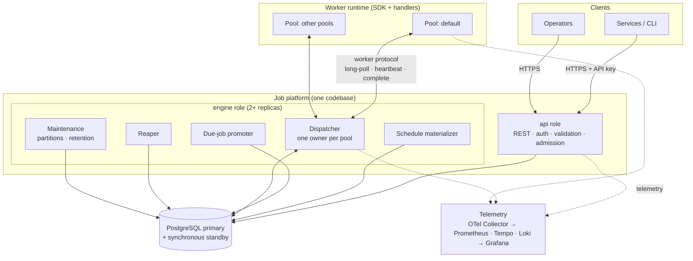

### Where the three "queues" live

| Structure | Lives in | Characteristics |
|---|---|---|
| Timer store | Active jobs in `SCHEDULED` or `RETRY_PENDING`, indexed by `run_at` | Up to 10M rows, mostly idle; needs a cheap "what is due?" query. |
| Ready queue | Active jobs in `READY`, under a partial index | Hot, high churn; the dispatcher applies priority and fairness. |
| Event stream | Audit table now; transactional outbox once a consumer exists | Append-only; see [§13](#13-event-architecture). |

Active jobs live in a small `jobs` table. Finished jobs move to `job_history`, which is partitioned by day, so retention drops whole partitions and can never delete live work ([LLD §8.1](low-level-design.md#81-storage-layout)).

## 9. Component architecture

### 9.1 Process roles

| Role | Contains | Scales with | State | Production replicas |
|---|---|---|---|---|
| `api` | REST handlers, auth, validation, idempotency, admission control | Request rate | Stateless | ≥ 2 |
| `engine` | Materializer, promoter, dispatcher, reaper, maintenance | Number of pools and dispatch rate | Soft state only (dispatch buffers, rebuilt from the DB) | ≥ 2 |
| worker | SDK plus handlers for one or more pools | Backlog per pool | In-flight attempts only | Per pool, autoscaled |
| all-in-one | `api` + `engine` (+ a demo worker) in one process | n/a | n/a | Local development only |

Database connections scale with `api` and `engine` replicas (for example, 4 × 10 + 3 × 10 = 70), never with the number of workers.

### 9.2 Modules

| Module | Responsibility | Used by |
|---|---|---|
| `domain` | Entities (JobType, Schedule, Job, Attempt), state machine, retry and priority policies. Pure logic, no I/O. | All |
| `api` | HTTP handlers, request validation, authentication and authorization, idempotency, rate limiting, admission control. | `api` |
| `scheduling` | Trigger evaluation (cron, intervals), materializer, promoter, misfire and overlap handling. | `engine` |
| `dispatch` | Pool ownership, worker sessions, ready buffers, weighted selection, tenant caps, assignment. | `engine` |
| `recovery` | Reaper, timeout enforcement, retry decisions, dead-lettering. | `engine` |
| `coordination` | Lease acquire, renew and release; epochs; fencing checks. | `engine` |
| `persistence` | Repositories, transactions, migrations, partition management. | `api`, `engine` |
| `events` | Audit writer, event catalog, outbox (later). | `api`, `engine` |
| `workerproto` | Worker protocol contract: messages and versioning. | `engine`, worker SDK |
| `worker-sdk` | Registration, long-poll loop, slot accounting, heartbeats, cancellation, self-fencing, handler API. | Workers |
| `observability` | Tracing, metrics, structured logging, ID propagation. | All |

### 9.3 Dependency rules

The codebase follows ports and adapters:

- `domain` depends on nothing, so it can be unit-tested exhaustively.
- Application modules (`scheduling`, `dispatch`, `recovery`, and the job/schedule commands behind `api`) depend on `domain` and on *ports*: `JobRepository`, `ScheduleRepository`, `LeaseStore`, `Clock`, `EventSink`.
- `persistence` implements those ports. Adding a broker-backed `EventSink` later touches no domain logic.
- Workers depend only on `workerproto` and `worker-sdk`, never on `persistence`.
- Module boundaries mark where services could later be extracted: `dispatch` (a matching service), `scheduling`, and notifications.

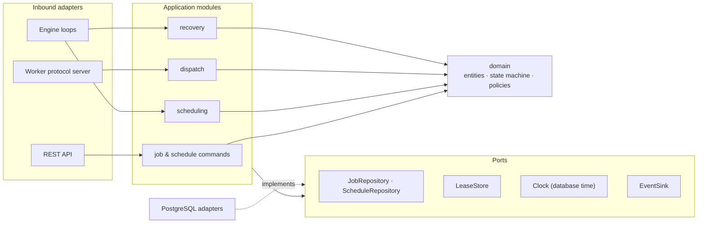

### 9.4 Conceptual data model

Entities and relationships only; the LLD defines columns, keys, indexes and partitioning.

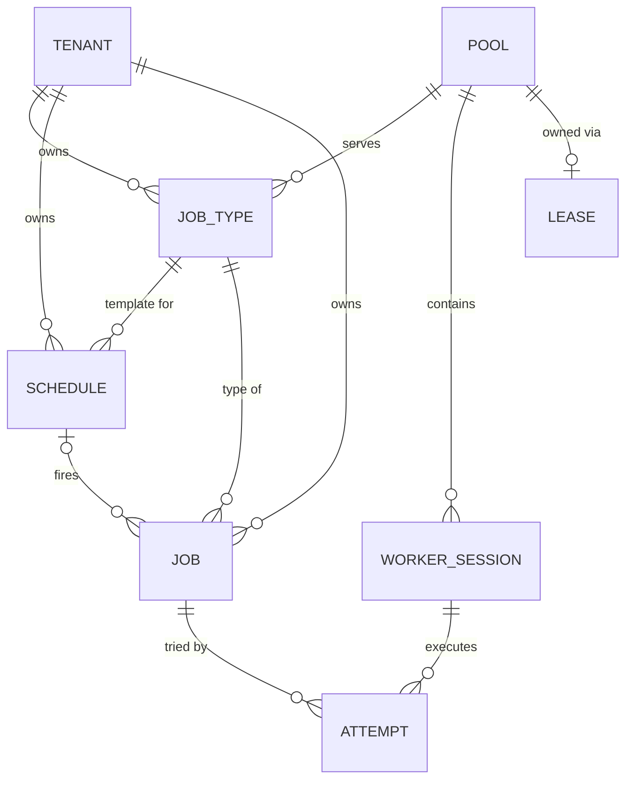

Supporting tables: `api_keys`, `idempotency_keys`, `audit_log`, `operations` (bulk actions) and `leases` (also used for singleton duties). Physically, jobs are split into active `jobs` and partitioned `job_history`, and attempts are append-only ([LLD §8](low-level-design.md#8-persistence)). Added later: `outbox`, `workflow_runs`, `job_dependencies`.

### 9.5 Interfaces

**Public REST API (summary).** Full contracts and the OpenAPI spec come in the LLD.

| Resource | Endpoints (V1) |
|---|---|
| Job types | `POST /v1/job-types` · `GET /v1/job-types` · `GET /v1/job-types/{name}` · `PATCH /v1/job-types/{name}` |
| Jobs | `POST /v1/jobs` · `GET /v1/jobs` · `GET /v1/jobs/{id}` · `POST /v1/jobs/{id}/cancel` · `POST /v1/jobs/{id}/pause` · `POST /v1/jobs/{id}/resume` · `POST /v1/jobs/{id}/run` · `POST /v1/jobs/{id}/retry` · `GET /v1/jobs/{id}/attempts` |
| Schedules | `POST /v1/schedules` · `GET /v1/schedules` · `GET /v1/schedules/{id}` · `PATCH /v1/schedules/{id}` · `DELETE /v1/schedules/{id}` · `POST /v1/schedules/{id}/pause` · `POST /v1/schedules/{id}/resume` · `POST /v1/schedules/{id}/trigger` |
| Workers and pools | `GET /v1/workers` · `POST /v1/workers/{id}/drain` · `DELETE /v1/workers/{id}` · `GET /v1/pools` · `POST /v1/pools/{name}/pause` · `POST /v1/pools/{name}/resume` |
| Bulk operations | `POST /v1/operations` (cancel or re-drive by filter) · `GET /v1/operations/{id}` |

`/attempts` corresponds to the `/executions` endpoint from the original brief. It is named after the Attempt entity.

**Worker protocol (internal).** Transported over gRPC with protobuf, as unary calls with a long-poll ([ADR-002](decisions/ADR-002-worker-pull-via-dispatcher.md), [ADR-014](decisions/ADR-014-worker-protocol.md)).

| Message | Direction | Purpose |
|---|---|---|
| `Register` | worker → engine | Opens a session: pool, capabilities, slots, runtime version. Returns `session_id`, lease TTL and the pool owner's address. |
| `Poll` | worker → engine | Long-polls for up to *n* assignments, where *n* is the number of free slots. |
| `Assignment` | engine → worker | Job, payload, `attempt_id`, fencing token, deadline, trace context. |
| `Heartbeat` | worker → engine | Renews the session and reports running attempts and progress. The response carries cancel requests and drain signals. |
| `Complete` | worker → engine | An attempt's outcome: success (with result), retryable failure (optional retry-after), non-retryable failure, timed out, or cancelled. Carries `attempt_id` and fencing token. |
| `Deregister` | worker → engine | Graceful shutdown after draining. |

## 10. Data flow

### 10.1 Job submission

1. The client sends `POST /v1/jobs`, optionally with an `Idempotency-Key` header.
2. `api` authenticates the API key, which determines the tenant and roles, then authorizes the request (for example, `CRITICAL` priority requires a specific role).
3. It validates the request: the job type exists and is enabled, the payload matches the type's JSON Schema and is ≤ 64 KB, and any overrides are within platform limits.
4. Admission control runs in order: the per-tenant rate limit, the per-tenant pending-jobs quota, then global overload shedding by priority ([§15.2](#152-backpressure-and-admission-control)). Tenant-limit rejections return `429`; global overload returns `503`. Both include `Retry-After`.
5. One transaction:
   - records the idempotency key, replaying the stored response if it already exists;
   - checks `dedupe_key`, returning the existing job if an active one has the same key;
   - inserts the job as `READY` (due now) or `SCHEDULED` (future `run_at`);
   - records `created_by` and `request_id` on the job, and links the idempotency key to it.
6. The transaction commits once the synchronous standby acknowledges, and `api` returns `201 Created`. A `READY` job is picked up by the dispatcher within about 100 ms.

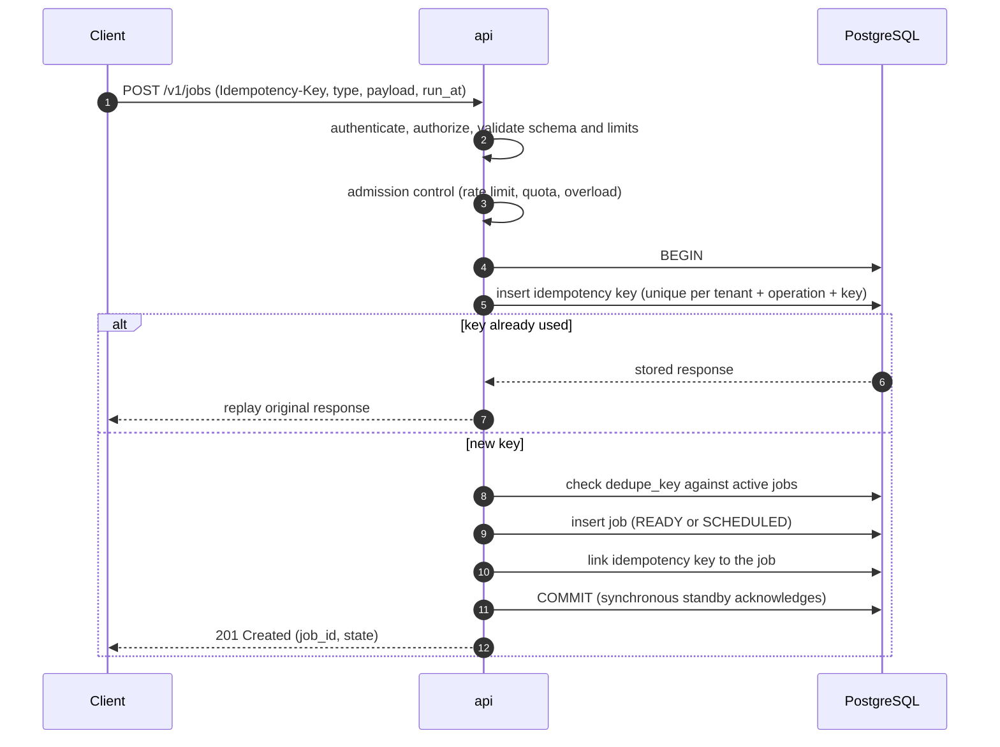

### 10.2 Job lifecycle

This is the high-level lifecycle. The LLD formalizes every valid and invalid transition, its guards and its owner.

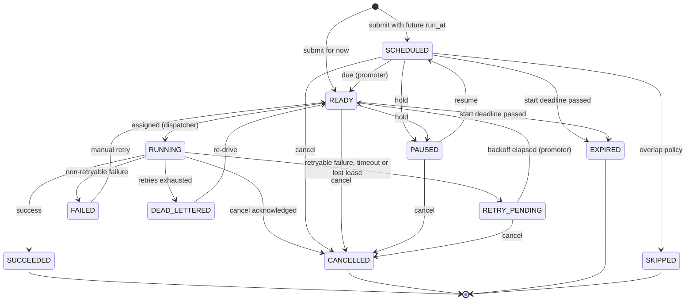

| State | Meaning | Terminal |
|---|---|---|
| `SCHEDULED` | Waiting for `run_at` (delayed or created by a schedule). | No |
| `READY` | Due and waiting for a worker. | No |
| `RUNNING` | An attempt holds a lease. | No |
| `RETRY_PENDING` | The last attempt failed; waiting out the backoff. | No |
| `PAUSED` | Held by a user before it started. | No |
| `SUCCEEDED` | Finished successfully. | Yes |
| `FAILED` | Non-retryable failure, or an at-most-once job whose outcome is unknown. | Yes, unless manually retried |
| `DEAD_LETTERED` | Retries exhausted, overall deadline passed, or poison job. | Yes, unless re-driven |
| `CANCELLED` | Cancelled by a user or a bulk operation. | Yes |
| `EXPIRED` | Its start deadline passed before it could start. | Yes |
| `SKIPPED` | Not run because of its schedule's overlap policy. | Yes |

**Who performs each transition**

| Transition | Performed by | Guard (conditional update) |
|---|---|---|
| create → `SCHEDULED` / `READY` | `api` | Idempotency and dedupe checks |
| `SCHEDULED` / `RETRY_PENDING` → `READY` | promoter | State unchanged and `run_at ≤ now()` |
| `SCHEDULED` → `SKIPPED` | promoter | Overlap policy is skip and an earlier run is still active |
| `SCHEDULED` / `READY` → `EXPIRED` | promoter or dispatcher | Start deadline passed |
| `READY` → `RUNNING` | dispatcher (pool owner) | `state = READY` and the pool lease epoch is still valid |
| `RUNNING` → any outcome | dispatcher, on `Complete` | Attempt is current and the fencing token matches |
| `RUNNING` → `RETRY_PENDING` / `DEAD_LETTERED` / `CANCELLED` | reaper | Attempt still running and its session expired or its deadline passed |
| Not-started → `PAUSED` / `CANCELLED`; `PAUSED` → `SCHEDULED` | `api` | Current state allows it |
| `FAILED` / `DEAD_LETTERED` → `READY` | `api` (retry, bulk re-drive) | State unchanged |

Every transition is an `UPDATE … WHERE id = ? AND state = ? [AND …]`. If zero rows change, another actor won the race; the caller re-reads the row and responds accordingly. No transition relies on in-memory state being current.

### 10.3 Cancellation, pause and run-now

- **Cancel a job that hasn't started:** it becomes `CANCELLED` immediately.
- **Cancel a running job:**
  1. `api` records `cancel_requested_at`.
  2. The dispatcher delivers the cancel in the next heartbeat response, within about 5 s.
  3. The handler sees its cancellation token and returns, and the worker reports `CANCELLED`.
  4. If the handler ignores the cancel, the attempt deadline or lease expiry ends it.

  Either way the job ends `CANCELLED` and is never retried.
- **Pause and resume** apply only to jobs that haven't started. **Run now** sets `run_at = now()` on a `SCHEDULED` or `PAUSED` job.
- **Pausing a schedule** stops materialization and withdraws the schedule's future jobs that are already materialized but not started. Resuming applies the misfire policy (details in the LLD).

### 10.4 Reads and bulk operations

- List queries use tenant-leading indexes on the primary in V1. A read replica can take list and dashboard traffic later. Read-your-writes after a submission still go to the primary.
- Bulk cancel and re-drive create an `operation` record. The engine processes it in rate-limited batches, and the operation reports progress and a final summary.

## 11. Scheduling architecture

Decision record: [ADR-001](decisions/ADR-001-scheduler-architecture.md).

### 11.1 Triggers

| Trigger | Next fire time computed from | Notes |
|---|---|---|
| One-off (`run_at` or delay) | The submission | Not a schedule: a job with a future `run_at`. |
| Cron + IANA time zone | The cron expression, evaluated in the schedule's zone | Optional seconds field. A time skipped by DST fires at the next valid instant; a repeated time fires once. |
| Fixed-rate | The previous *nominal* fire time plus the interval | Doesn't drift with execution time. |
| Fixed-delay | The previous run's *completion* plus the delay | Computed in the completion transaction, so it is coupled to execution. |

Per-tenant policy enforces a minimum interval (60 s by default) and a maximum number of active schedules.

### 11.2 Pipeline: materialize, promote, dispatch

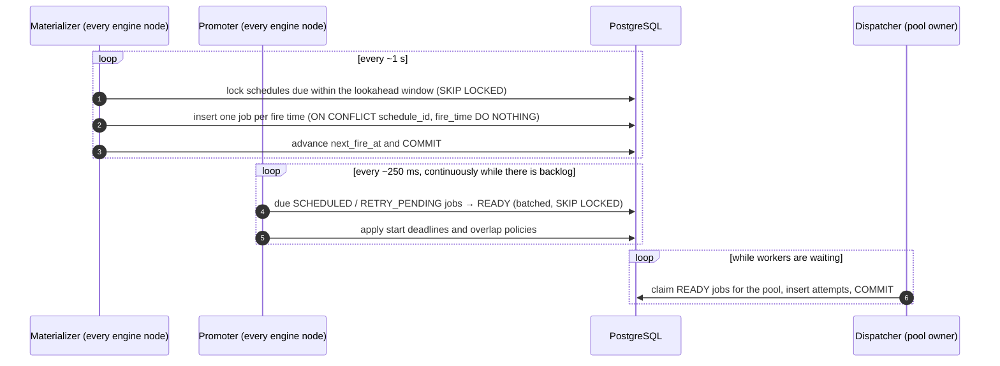

### 11.3 Materializer

- Runs on every engine node about once a second. Row claims (`FOR UPDATE SKIP LOCKED`) mean nodes never work on the same schedule at the same time.
- Selects schedules with `next_fire_at ≤ now() + lookahead` (2 min by default) in batches.
- For each fire time in the window, inserts a job with `schedule_id`, `fire_time` and `run_at = fire_time + jitter_offset`. The unique `(schedule_id, fire_time)` constraint makes the insert idempotent (I2), even if row locking were somehow bypassed.
- Advances `next_fire_at` in the same transaction.
- The jitter offset is deterministic (a hash of `schedule_id` and `fire_time`, within the schedule's jitter window), so materializing again produces the same `run_at`.
- Enforces max runs, end time and the minimum interval.
- **Misfires:** if `next_fire_at` is older than the misfire threshold (1 min by default), the schedule's policy applies:
  - *fire once*: one job for the latest missed fire time;
  - *skip*: jump to the next future fire time;
  - *fire all*: every missed fire time, up to a cap.

### 11.4 Promoter

- Runs on every engine node, every ~250 ms and continuously while there is backlog.
- In each batch, moves due `SCHEDULED` and `RETRY_PENDING` jobs to `READY` and stamps `ready_at` (illustrative SQL):
  ```sql
  UPDATE jobs SET state = 'READY', ready_at = now()
  WHERE id IN (
    SELECT id FROM jobs
    WHERE state IN ('SCHEDULED', 'RETRY_PENDING') AND run_at <= now()
    ORDER BY run_at
    LIMIT 1000
    FOR UPDATE SKIP LOCKED);
  ```
- Applies start deadlines (→ `EXPIRED`) and, for schedule-created jobs, the overlap policy: skip (→ `SKIPPED`), buffer one, allow, or cancel the previous run.
- Partial indexes limit the scan to due rows.

### 11.5 Time and clocks

- The primary's clock (`now()`) is the only time authority for due checks, leases and deadlines.
- Node clocks are used only for logs, metrics and local *durations* measured on monotonic clocks, such as a worker's attempt timeout.
- A database failover can shift the reference clock by milliseconds (NTP-synced hosts). Lease TTLs are orders of magnitude larger.

### 11.6 Precision and the top-of-the-minute spike

- **Lag budget:** promoter interval (≤ 250 ms) + promotion transaction + dispatcher pickup (~100 ms), which is well under 1 s.
- Because schedules are materialized up to 2 min ahead, a spike at 00:00:00 costs batched state updates, not inserts plus schedule evaluation at the same instant.
- A herd much larger than tier M's bursts, such as 100k schedules at the same second, takes a few seconds to promote. Such a herd mostly turns into *queue wait* anyway, since only about 10k slots exist. Priority and capacity govern queue wait. Jitter windows are the recommended mitigation.
- **LLD decision:** keep the promotion step (a small hot `READY` set and explicit metrics), or let the dispatcher claim due jobs directly (no promotion writes). See [Appendix C](#appendix-c--open-questions-for-the-lld).

### 11.7 Schedule changes

- **Edits** apply to future fire times. Future jobs already materialized from the old definition but not started are withdrawn, then re-materialized ([ADR-016](decisions/ADR-016-withdrawing-provisional-schedule-jobs.md)).
- **Delete** is a soft delete plus withdrawal of those jobs. History is kept.
- **Pause and resume**: see [§10.3](#103-cancellation-pause-and-run-now).
- **Fixed-delay** schedules compute `next_fire_at` when the previous run completes, in the same transaction.

## 12. Worker architecture

Decision record: [ADR-002](decisions/ADR-002-worker-pull-via-dispatcher.md).

### 12.1 Worker runtime (SDK)

- **Registers** a session with one pool, declaring:
  - capabilities (job types and versions);
  - slots (maximum concurrent attempts);
  - labels (region, CPU and memory class, GPU later);
  - runtime version.
- **Long-polls** for up to `free_slots` assignments.
- **Runs** each assignment in its own execution context, which provides:
  - `job_id` (the idempotency key);
  - `attempt_id` and fencing token;
  - the deadline and a cancellation token;
  - trace context and a progress hook.
- **Heartbeats** every 5 s per *session*, not per job, listing running attempts and progress.
- **Enforces the attempt deadline** locally on a monotonic clock: it cancels the handler and reports `TIMED_OUT`.
- **Self-fences:** if it cannot renew its session for TTL minus a safety margin (25 s of a 30 s TTL), it cancels running handlers and discards their results.
- **Drains** on `SIGTERM`: stops polling, lets in-flight attempts finish within the grace period, reports them, and deregisters. Attempts that can't finish in time are released and retried.

### 12.2 Worker sessions and leases

- Each session has a lease (TTL 30 s). The dispatcher renews all of its sessions in one batched `UPDATE` per interval, so writes scale with engines, not workers.
- Attempts reference their session. The reaper expires sessions whose `lease_expires_at < now()` and marks their running attempts `LOST`.
- A crashed worker and a disconnected worker look the same and follow the same path.

### 12.3 Dispatcher

- **Ownership:** each pool has a lease, and its holder is that pool's dispatcher. Workers connect to any engine node; a node that doesn't own the pool redirects the worker to the owner, whose address is stored with the lease.
- **Demand-driven claiming:** it claims only as many jobs as there are waiting slots, so no claimed-but-unassigned jobs sit in memory.
- **Selection:**
  1. Filter by capability: job type and version, plus labels.
  2. Choose a priority class by smooth weighted round-robin (8:4:2:1) among classes that have eligible work. This is work-conserving: an empty class's share goes to the others, and no non-empty class starves.
  3. Within the class, take the earliest `run_at` first, skipping tenants that are at their concurrency cap for this pool.
- **Commit before send:** the attempt row (with fencing token) and the job's move to `RUNNING` are committed, guarded by the pool epoch, *before* the assignment is sent. If delivery fails, the attempt is released immediately, or the reaper catches it ([ADR-015](decisions/ADR-015-releasing-undelivered-assignments.md)).
- **Soft state only:** ready buffers, per-tenant running counts and waiting polls are rebuilt from the database when ownership changes. Tenant caps are exact in steady state and briefly approximate during an ownership change.

### 12.4 Worker selection strategies

| Strategy | How it applies |
|---|---|
| Round robin | Not needed: pull already spreads work. |
| Least loaded | Implicit: only workers with free slots poll. |
| Weighted | Priority classes 8:4:2:1; tenant weights with V2 fair share. |
| Capability-based | Explicit filter on job type, version and labels. |
| Priority-aware | The class is chosen before the job. |
| Resource-aware | Later: jobs declare CPU and memory, workers advertise capacity, and the dispatcher bin-packs. V1 uses one pool per resource class. |

### 12.5 Worker execution

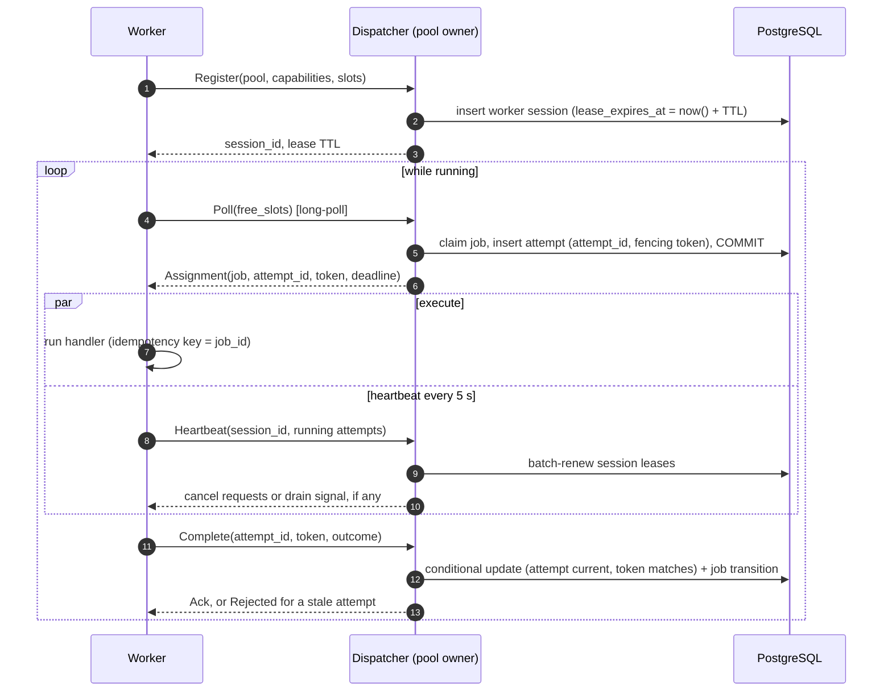

### 12.6 Autoscaling signals

Each pool exports its `READY` count, the age of its oldest `READY` job, and slot utilization. Workers scale out when the oldest `READY` age exceeds its target or utilization passes about 80%, and scale in (with drain) when utilization stays low.

### 12.7 Long-running jobs

- Session heartbeats keep leases alive however long a job runs. The **lease** is about *liveness*; the **attempt timeout** is about *duration*. They are separate settings.
- Handlers may report progress; checkpoint hooks are a later extension.
- A job longer than a pool's drain grace period is retried if a deploy interrupts it. This is a documented consequence of at-least-once execution.

## 13. Event architecture

Decision record: [ADR-003](decisions/ADR-003-message-broker.md).

### 13.1 What is recorded, and where

| Record | Where | Written |
|---|---|---|
| Lifecycle history | Active `jobs`; finished jobs in `job_history` and `attempts`, partitioned by day (source of truth) | In the state-change transaction |
| Audit trail (who did what) | `audit_log`, append-only, for control-plane actions (submissions are attributed on the job) | In the same transaction as the action |
| Metrics | Emitted directly by processes through OpenTelemetry | Never derived from events |
| Domain events | Transactional outbox, **only for event types with a subscriber** | In the state-change transaction (once a consumer exists) |

Writing about 4 events for every job at tier M would add 40–200M rows a day with no reader. So the V1 event catalog is defined as a contract, and events are **published only once a subscriber exists**.

### 13.2 Event catalog (contract)

`JobCreated`, `JobScheduled`, `JobReady`, `JobStarted`, `JobSucceeded`, `JobFailed`, `JobRetryScheduled`, `JobDeadLettered`, `JobCancelled`, `JobExpired`, `ScheduleFired`, `WorkerRegistered`, `WorkerDeregistered`, `WorkerLost`.

Envelope fields:
- `event_id` (UUIDv7);
- `type` and `version`;
- `occurred_at`;
- `tenant_id`;
- `aggregate_id` (usually `job_id`) and a per-aggregate `sequence`;
- `correlation_id` and trace context;
- a `data` section that references payloads rather than copying them.

### 13.3 Transactional outbox (designed now, built with the first consumer)

- The outbox row is written in the same transaction as the state change, so the database can't change without the event being recorded, and vice versa.
- A relay publishes rows to the broker in order and deletes (or marks) them. One relay runs per stream, guarded by a singleton lease.
- **Duplicates:** if the relay crashes between publishing and marking, rows are published again. Consumers deduplicate by `event_id`.
- **Ordering:** guaranteed per aggregate through `sequence`, not globally.
- **Cleanup:** published rows are deleted in batches, or the table is time-partitioned and whole partitions are dropped.
- **Broker outage:** the outbox grows and an outbox-lag alert fires. Job processing is unaffected.

### 13.4 Event flow

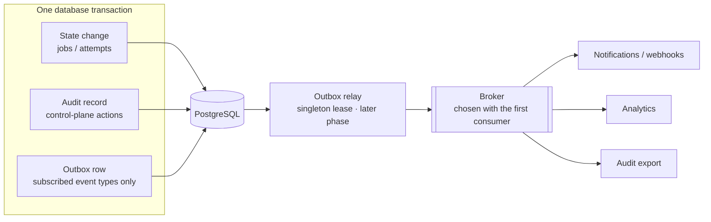

## 14. Failure handling

### 14.1 Mechanisms

| Mechanism | Protects against | Used by |
|---|---|---|
| State-guarded conditional updates | Two actors changing the same job | Every transition |
| Unique constraints | Duplicate jobs from schedules; duplicate submissions | Materializer, `api` |
| Row claims (`SKIP LOCKED`) | Two nodes working on the same rows | Materializer, promoter, dispatcher, reaper |
| Leases with expiry | Crashed or partitioned owners holding work forever | Worker sessions, pool ownership, singleton duties |
| Fencing tokens and epochs | Zombies and stale owners writing late | Attempt completion, dispatcher writes |
| Deadlines | Jobs hanging forever | Attempt timeout, start deadline, overall deadline |
| Idempotency keys | Client retries creating duplicates | `api` |
| Reaper warm-up | Expiring everything at once after a database outage | Reaper |
| Self-fencing | Zombie side effects after losing a lease | Workers, pool owners |
| Bounded retries and dead-letter state | Poison jobs and infinite retry loops | Retry policy |

### 14.2 Timing defaults

| Parameter | Default | Reasoning |
|---|---|---|
| Worker heartbeat interval | 5 s | Delivers cancels quickly; one message per worker, not per job. |
| Worker session lease TTL | 30 s | Survives a missed heartbeat and an engine failover (≤ ~15 s) without expiring healthy workers. |
| Pool lease TTL / renewal | 10 s / every 3 s | Bounds the dispatch pause after an engine failure. The owner stops dispatching once its renewal is 8 s overdue (a 2 s safety margin). |
| Singleton lease TTL | 30 s | Maintenance work tolerates slower failover. |
| Promoter interval | ~250 ms, continuous while there is backlog | Keeps scheduling lag well under 1 s. |
| Materializer interval / lookahead | 1 s / 2 min | Job rows exist well before they are due; the window is small enough to re-materialize cheaply after an edit. |
| Dispatcher `READY` poll | ~100 ms while workers are waiting | Low dispatch latency without `LISTEN/NOTIFY`. |
| Reaper interval / warm-up | 5 s / ≥ 30 s after (re)connecting to the DB | Warm-up lets live sessions renew before anything expires (S6). |
| Engine-side timeout grace | 30 s after the attempt deadline | The worker enforces deadlines first; the engine is the backstop. |
| `Idempotency-Key` retention | 24 h | Covers client retry windows. |

These are starting points, to be tuned with load and failure tests.

### 14.3 Retry flow

Decision record: [ADR-008](decisions/ADR-008-retry-strategy.md). Defaults: exponential backoff with full jitter (base 10 s, doubling, capped at 1 h), at most 10 attempts, and a 24 h ceiling. Job types and individual jobs can override these within platform limits.

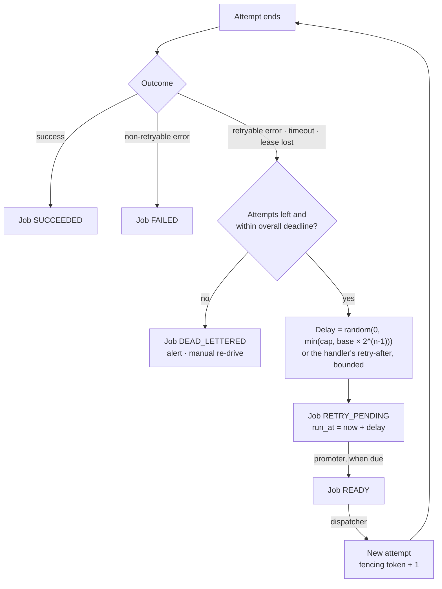

The retry decision is made in the same transaction that records the failed attempt. There is no separate retry process with its own state.

### 14.4 Recovery from a worker failure

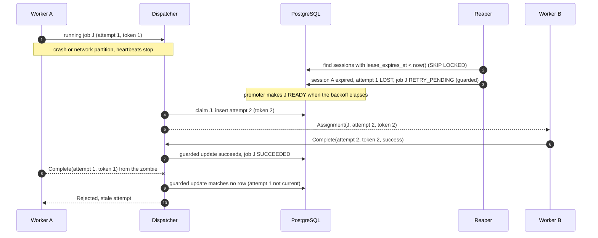

### 14.5 Failure scenarios

Each scenario lists detection, recovery, consistency, duplicate execution, corruption risk and what users see.

#### S1 — An engine node (scheduler) crashes
- **Detection:** none is needed for correctness, because scheduling loops are leaderless. Pool leases held by the dead node expire after 10 s, and the container platform restarts it.
- **Recovery:** surviving nodes keep materializing, promoting and reaping. Other nodes take over its pools and rebuild dispatch state from the database. Row locks from its open transactions are released when PostgreSQL drops the dead connection. Short transactions, server TCP keepalives and `idle_in_transaction_session_timeout` bound that to seconds.
- **Consistency:** every step is one transaction; an aborted one leaves no trace.
- **Duplicate execution:** none from scheduling (unique `(schedule_id, fire_time)` plus guarded updates).
- **Corruption risk:** none.
- **User-visible:** dispatch for the node's pools pauses for ≤ ~15 s. If *all* engine nodes are down, lag grows and the misfire policy applies after a long outage.

#### S2 — Several schedulers try to schedule the same job
- **Detection:** not needed; it is prevented structurally.
- **Recovery:** not applicable.
- **Consistency:** row claims stop two materializers from processing a schedule at the same time. If they somehow did, the unique `(schedule_id, fire_time)` constraint rejects the second insert. A second promotion matches no row (`WHERE state = 'SCHEDULED'`). Only the pool owner claims jobs, a stale owner is fenced by its epoch, and `READY → RUNNING` can succeed only once.
- **Duplicate execution:** no duplicate jobs or attempts.
- **Corruption risk:** none.
- **User-visible:** nothing.

#### S3 — A worker crashes during execution
- **Detection:** heartbeats stop. The session lease expires after 30 s, and the reaper finds it within 5 s.
- **Recovery:** the reaper marks the session expired and its running attempts `LOST`. Each job moves to `RETRY_PENDING`, or to `DEAD_LETTERED` if attempts are exhausted; a crash counts as an attempt, which stops poison jobs. The next attempt gets fencing token + 1.
- **Consistency:** all transitions are guarded, and attempt history is kept.
- **Duplicate execution:** possible. The worker may have finished some side effects before crashing, and the retry runs them again (at-least-once). Handlers deduplicate on `job_id`.
- **Corruption risk:** none to platform state.
- **User-visible:** the job takes longer (TTL plus backoff). The attempt list shows a `LOST` attempt with reason "worker session expired".

#### S4 — A worker is partitioned from the engine but keeps executing
- **Detection:** the engine sees heartbeats stop and the session expires. The worker's SDK sees its renewals failing.
- **Recovery:** the job is retried elsewhere with a new token. Worker A self-fences after 25 s without renewal: it cancels its handlers and discards their results. If A reports later anyway, the report is rejected.
- **Consistency:** platform state reflects only the current attempt. A zombie can't overwrite it because completion is guarded by `attempt_id` and fencing token.
- **Duplicate execution:** possible for external side effects during the overlap window, which self-fencing bounds. The idempotency key mitigates it; handlers can also pass the fencing token downstream where a system supports it.
- **Corruption risk:** none to platform state. Downstream duplicates are possible if a handler isn't idempotent, which violates the handler contract.
- **User-visible:** attempt 1 shows `LOST` and attempt 2 shows the result. Any duplicate is visible only downstream.

#### S5 — The message broker goes down
- **V1:** there is no broker on the job path, so this scenario doesn't apply.
- **Later (outbox + broker):**
  - *Detection:* publish errors and outbox lag.
  - *Recovery:* the relay retries and the backlog drains in order when the broker returns.
  - *Consistency:* jobs are unaffected.
  - *Duplicate execution:* none, though events may be duplicated and consumers deduplicate by `event_id`.
  - *Corruption risk:* none.
  - *User-visible:* notifications and webhooks are delayed.

#### S6 — The database goes down
- **Detection:** connection errors and health checks fail. Managed failover promotes the synchronous standby.
- **Recovery:**
  - `api` returns `503` with `Retry-After`. Clients retry safely with `Idempotency-Key`.
  - Engine loops back off and retry. Pool leases lapse; on reconnect, owners re-acquire (epoch + 1) and reload state.
  - Workers keep executing in-flight jobs and buffer `Complete` reports, which dispatchers retry until acknowledged.
  - **Reaper warm-up:** during the outage no leases could be renewed, so every session looks expired when the database returns. The reaper expires nothing until its node has had database connectivity for at least one session TTL. That gives live workers time to renew, and avoids a wave of false expiries and duplicate retries.
- **Consistency:** synchronous replication means no acknowledged write is lost (RPO ≈ 0). Transactions in flight at the moment of failure abort, and callers retry idempotently.
- **Duplicate execution:** limited to jobs whose worker died before its completion could be recorded.
- **Corruption risk:** none under ACID with a synchronous standby. Promoting an *asynchronous* replica would lose data, so it is disallowed.
- **User-visible:** `503`s during failover (typically one to a few minutes). Scheduling and dispatch pause while running jobs continue. Lag metrics spike, and the misfire policy applies after a long outage.

#### S7 — A job runs longer than expected
- **Detection:** the attempt deadline is sent with the assignment. The worker enforces it; the reaper enforces deadline plus 30 s grace as a backstop.
- **Recovery:** the worker cancels the handler and reports `TIMED_OUT`. If it doesn't, the engine marks the attempt `TIMED_OUT`. Timeouts are retryable. Long jobs set a longer timeout; heartbeats keep their lease alive meanwhile.
- **Consistency:** a completion arriving after the timeout is rejected, because the attempt is no longer current.
- **Duplicate execution:** possible if a handler ignores cancellation while its retry runs (the same as S4).
- **Corruption risk:** none.
- **User-visible:** a `TIMED_OUT` attempt followed by a retry, plus duration metrics per job type.

#### S8 — A job is submitted twice
- **Detection:** `Idempotency-Key` is unique per tenant, operation and key, and stored with a fingerprint of the request.
- **Recovery:**
  - A repeated request gets the original response replayed.
  - A concurrent duplicate waits on the unique index and then gets the replay, or `409` if the first request is still in flight after the lock timeout.
  - The same key with a different body gets `422`.
  - `dedupe_key` returns the existing active job.
- **Consistency:** the key and the job are inserted in the same transaction.
- **Duplicate execution:** none while the key is retained (24 h). Without a key, or after that window, a retrying client can create duplicates; `dedupe_key` covers business-level uniqueness.
- **Corruption risk:** none.
- **User-visible:** the same `job_id` comes back, marked as a replay.

#### S9 — A message or event is delivered twice
- **V1, worker protocol:**
  - A repeated `Complete` with the same `attempt_id`, token and outcome is a no-op success; a conflicting outcome is rejected.
  - Assignments carry `attempt_id`, so a worker ignores a duplicate assignment for an attempt it is already running.
  - Heartbeats are naturally idempotent.
- **Later, broker events:** consumers deduplicate by `event_id` and use the per-aggregate `sequence` for ordering.
- **Consistency and corruption:** no double transitions, no corruption.
- **User-visible:** nothing.

#### S10 — The retry processor crashes
- **Design note:** there is no standalone retry processor. The retry decision is made in the transaction that records the failure, and the retry itself is a `RETRY_PENDING` row that any node's promoter picks up.
- **Detection:** not needed.
- **Recovery:** a crash mid-transaction rolls back. The attempt stays `RUNNING` until the worker's retried `Complete` succeeds or its session lease expires and the reaper handles it.
- **Duplicate execution:** nothing beyond the normal at-least-once cases.
- **Corruption risk:** none.
- **User-visible:** a short delay at most.

#### S11 — A leader crashes
- **Design note:** there is no global leader. Pool owners and singleton duties hold scoped leases ([ADR-006](decisions/ADR-006-leader-election.md)).
- **Detection:** the lease isn't renewed and expires after 10 s.
- **Recovery:** another engine node acquires the lease with epoch + 1 and reloads the pool state (running counts per tenant, ready backlog). Workers are redirected, reconnect, and re-register their running attempts. The session TTL (30 s) is longer than the failover time, so live sessions don't expire.
- **Consistency:** the old owner's writes are fenced by the epoch check inside the same transaction. In-memory state is disposable and rebuilt from the database.
- **Duplicate execution:** none from the failover itself. Tenant caps can be briefly approximate.
- **Corruption risk:** none.
- **User-visible:** dispatch for the affected pools pauses for up to ~15 s. Running jobs are unaffected.

#### S12 — A network partition occurs
- **Worker ↔ engine:** as in S4.
- **Engine ↔ database:** the node can't renew its leases. It stops dispatching once renewal is 8 s overdue (self-fencing), and any late write fails the epoch check anyway. Other nodes take over.
- **`api` ↔ database:** writes return `503`.
- **Client ↔ `api`:** clients retry with `Idempotency-Key`.
- **Consistency:** the database is the single arbiter, so split brain can't commit conflicting state.
- **Duplicate execution:** only the worker-level at-least-once case.
- **Corruption risk:** none.
- **User-visible:** partial unavailability, depending on which link failed.

#### S13 — Clocks drift apart between machines
- **Design:** every correctness-relevant time comparison (lease expiry, due checks, deadlines) uses the primary's clock. Workers measure timeouts as durations on monotonic clocks, and node wall clocks feed only logs and metrics.
- **Detection:** NTP monitoring. Engine nodes also export their offset from the database clock as a metric.
- **Recovery:** not needed for normal drift. A large jump on the database host would distort lag and expiry, so offset alerts page an operator.
- **Duplicate execution and corruption:** none from node drift. Lease TTLs are far larger than realistic drift.
- **User-visible:** nothing under normal drift.

#### S14 — Incoming jobs jump 100×
- **Scale of the problem:** 100× the average (115–580/s) is 11.5k–58k/s, above the design peak.
- **Detection:** admission metrics, backlog age, database CPU and WAL rate, per-tenant request rates.
- **Recovery:** layered backpressure ([§15.2](#152-backpressure-and-admission-control)):
  1. per-tenant rate limits return `429`;
  2. per-tenant pending quotas return `429`;
  3. global shedding rejects new `LOW`, then `NORMAL`, submissions, while `CRITICAL`, `HIGH` and schedule-created jobs are always admitted;
  4. the database backlog absorbs whatever was accepted;
  5. worker pools autoscale on backlog;
  6. dispatchers never claim more jobs than there are free slots.
- **Consistency:** unaffected; nothing accepted is dropped.
- **Duplicate execution:** none. Client retries after a `429` are safe with `Idempotency-Key`.
- **Corruption risk:** none. The real risk is database saturation, which admission limits and connection-pool limits guard against.
- **User-visible:** `429`s for lower priorities and noisy tenants, and higher lag for accepted work, all visible on dashboards.

## 15. Scalability

### 15.1 Capacity model (tier M)

| Quantity | Estimate | Notes |
|---|---|---|
| Row writes per job (happy path) | ~8, across 3 transactions | Insert + idempotency key; claim (updates the job); complete (attempt row + move to history). Scheduled jobs add a promotion update. |
| Average write load | ~1–5k rows/s | At 115–580 jobs/s. Comfortable for one primary. |
| Burst write load | Up to ~40k rows/s | At 5k jobs/s. Requires batching: claims, lease renewals and completions are grouped into shared transactions. |
| Database connections | ~50–100 | `api` and `engine` pools only; workers use none. |
| Hot `READY` set | Thousands of rows normally | Grows only while demand exceeds capacity. |
| Timer store | Up to 10M rows | Indexed by `run_at`; mostly idle. |
| History (30 days) | 300M–1.5B job rows, plus attempts | Hundreds of GB up to 1–2 TB, dominated by payloads. Time-partitioned. Payloads may be kept for less time than metadata (LLD). |

**Load-test gate.** Before anything beyond the core is built, a walking skeleton must show one PostgreSQL primary sustaining 5k jobs/s bursts with p99 dispatch ≤ 1 s. If it can't, the architecture is revisited before further investment.

### 15.2 Backpressure and admission control

| Layer | Mechanism | Response |
|---|---|---|
| 1. Request limits | Body size, payload ≤ 64 KB, schema validation | `413` / `422` |
| 2. Tenant rate limit | Token bucket on each `api` node (tenant limit ÷ replica count) | `429` + `Retry-After` |
| 3. Tenant quotas | Pending jobs, active schedules, minimum schedule interval | `429` / `422` |
| 4. Global overload shedding | When backlog age or database saturation crosses thresholds, reject new `LOW`, then `NORMAL` submissions | `503` + `Retry-After` |
| 5. Durable buffering | Accepted jobs wait in the database | n/a |
| 6. Dispatch flow control | Claim only as many jobs as there are free worker slots | n/a |
| 7. Capacity | Worker pools autoscale on backlog; `api` autoscales on CPU | n/a |
| 8. Execution protection | Per-(tenant, pool) concurrency caps; pausing a pool or job type | n/a |

Schedule-created jobs skip layers 2–4 because they were admitted when the schedule was created. Their misfire and overlap policies absorb any backlog.

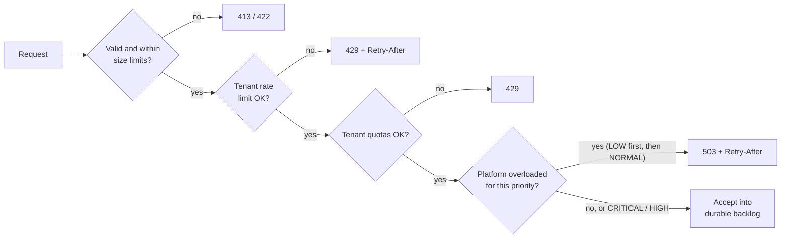

### 15.3 Scaling each tier

| Tier | How it scales | Limit and next step |
|---|---|---|
| `api` | Stateless; horizontal on CPU and request rate | Database connections; add a pooler if needed |
| `engine` | Pools spread across replicas through leases; scheduling loops parallelize through row claims | One pool's dispatch rate is bounded by its owner; next, split the pool into leased partitions |
| Workers | Per-pool autoscaling on backlog and utilization | None on the platform side (no database connections) |
| Database | Vertical first; time partitioning; read replica for lists and dashboards | Write ceiling; next, offload payloads, then shard by tenant |

### 15.4 Bottlenecks and evolution triggers

| Signal | Action |
|---|---|
| Primary write or WAL load sustained above ~70% | Batch harder; move payloads to object storage; then shard by tenant (cells, or a distributed PostgreSQL). |
| One pool's dispatch rate exceeds what its owner can handle | Split the pool into N leased partitions, keyed by a hash of `job_id`. |
| Promotion or claim scans dominate database time | Revisit promotion versus direct claiming; hash-partition the ready set. |
| Precision requirement tightens toward ~100 ms | In-memory timing wheel per partition, loaded ahead from the database. |
| Consumers outside the process appear | Outbox relay plus broker ([ADR-003](decisions/ADR-003-message-broker.md)). |
| Exact global rate limits become necessary | Shared limiter such as Redis ([ADR-011](decisions/ADR-011-caching-and-redis.md)). |
| Availability target above 99.95%, or data-residency rules | Multi-region design (a major change). |

### 15.5 Partitioning keys

| Key | Good for | Drawbacks | V1 use |
|---|---|---|---|
| Time (`created_at` / `run_at`) | Retention by dropping partitions; history scans | The newest partition is hot | History tables partitioned by time |
| `pool` | Dispatch ownership and locality | Skew if one pool dominates | Unit of dispatcher ownership |
| `tenant_id` | Isolation, cells, per-tenant quotas | Skew from large tenants | Leading index column; future shard key |
| `job_id` | Even spread | No locality; cross-partition scans | Future sub-partitioning of hot pools |
| `job_type` | Worker locality | Skew; couples types to storage | Only indirectly, through pools |
| `region` | Geographic scheduling | Multi-region complexity | Not used |

No sharding in V1.

### 15.6 Path to tier L

Pools split into leased partitions; optional timing wheels per partition for precision; outbox to a partitioned log (e.g., Kafka) for events; storage sharded by tenant, where each cell is a V1-shaped stack; a thin routing layer that maps tenants to cells. This is the Alternative 4 direction, and the revisit triggers in [ADR-001](decisions/ADR-001-scheduler-architecture.md) and [ADR-004](decisions/ADR-004-database.md) say when to start.

## 16. Security

### 16.1 Trust boundaries

| Boundary | Controls |
|---|---|
| Client → `api` | TLS 1.2+. API keys (V1) scoped to a tenant and roles, stored as SHA-256 hashes with a lookup prefix, shown once, rotatable, with expiry and last-used tracking. OIDC/JWT later. Size limits, schema validation, rate limits. |
| Worker → `engine` | TLS. Per-pool bearer tokens (mTLS optional later, [ADR-012](decisions/ADR-012-language-and-core-libraries.md)). A worker can register only for pools it is authorized for. No database access. |
| `api` / `engine` → PostgreSQL | TLS. Least-privilege roles: the runtime role cannot run DDL, migrations use a separate role, and `audit_log` is insert-only for the runtime role. |
| Handlers → external systems | Secrets resolved at execution time from AWS Secrets Manager through the worker's IAM role. Egress controlled per pool. |
| Operators → platform | The same API, with operator and admin roles. Every action audited. |

### 16.2 Authorization (RBAC)

Job types, schedules and jobs belong to a tenant. Pools are platform resources operated by the platform team.

| Role | Scope | Can |
|---|---|---|
| `viewer` | Tenant | Read jobs, attempts, schedules and job types. |
| `submitter` | Tenant | Viewer, plus submit and cancel jobs and manage schedules; priority up to `HIGH`. |
| `operator` | Tenant | Submitter, plus pause, retry and bulk operations, pausing the tenant's job types, and `CRITICAL` priority within quota. |
| `admin` | Tenant | Operator, plus managing job types, API keys and tenant settings. |
| `platform-admin` | Platform | Pools, quotas, cross-tenant operations and worker management. |

### 16.3 Tenant isolation and noisy neighbours

- `tenant_id` comes only from the authenticated credential, never from the request body.
- Repository methods take the tenant as a required argument, so every query is tenant-scoped by construction. CI runs cross-tenant access tests. PostgreSQL row-level security as a second line of defence is an LLD decision.
- Noisy-neighbour controls:
  - at admission: per-tenant rate limits and quotas;
  - at dispatch: per-(tenant, pool) concurrency caps, weighted priority and role-restricted `CRITICAL`;
  - later: weighted fair share and dedicated pools for large tenants.
- V1 handlers are trusted platform code, so resource isolation is per pool rather than per tenant.

### 16.4 Data protection

- **Encryption at rest:** managed PostgreSQL storage and backups are encrypted with KMS keys.
- **Payloads** may contain personal data. They are never logged and never copied into events (events carry `job_id`). Handler error messages are truncated, and the SDK offers redaction hooks.
- **Secrets** never go in payloads. Jobs reference them by name, and handlers resolve them at execution time.
- **Later:**
  - field-level (envelope) encryption for especially sensitive payload fields;
  - payload retention shorter than metadata retention;
  - tenant- and job-scoped purge operations for deletion requests.

### 16.5 Execution isolation

- **V1:** handlers are trusted code written and deployed by the platform team (A3, A16). Isolation is per pool: separate deployments, IAM roles, network policies and resource limits.
- **Untrusted code** is out of scope. If it's ever needed, it would run through a container executor with:
  - a sandbox (gVisor or Firecracker microVMs);
  - no ambient credentials and egress allow-lists;
  - CPU, memory and time limits;
  - read-only filesystems and signed, scanned images.
- **A future HTTP executor** must prevent SSRF: allow-listed destinations, no access to link-local or cloud metadata addresses, and per-tenant egress policies.

### 16.6 Audit

- `audit_log` records the actor, tenant, action, target, request ID, source address, outcome and time. It is written in the same transaction as the action.
- Individual job submissions (10–50M a day) are not audited. Each job records `created_by` and `request_id`, which attribute it without a year of audit rows.
- The runtime role can only insert. Retention is at least 1 year *(proposed)*, and export to object storage becomes an outbox consumer later.

### 16.7 Other controls

- Parameterized queries only; no SQL built from input.
- Dependency and image scanning in CI; minimal base images; containers run as non-root.
- No browser clients in V1, so no CORS surface. Security headers on every response.

## 17. Observability

### 17.1 Identifiers

| ID | Created by | Carried on |
|---|---|---|
| `request_id` | `api`, per request | Logs, audit, response header |
| `correlation_id` | The client's header, or `api` | Stored on the job; every log line, span and event about it |
| `tenant_id` | Authentication | Everything (a metric label too, since internal tenants are a bounded set) |
| `job_id` | `api` or materializer | Everything about the job; the handler's idempotency key |
| `schedule_id` | The schedule | Jobs it creates |
| `attempt_id` | Dispatcher | Worker logs, spans, completion |
| `worker_id` / `session_id` | Worker registration | Attempts, heartbeats, logs |
| `trace_id` | OpenTelemetry | Stored on the job so execution spans can link to the submission trace |

### 17.2 Tracing

- OpenTelemetry in every process, with W3C trace context.
- A submission produces one trace. Execution may happen hours later, so each attempt starts its own trace with a **span link** back to the submission span, rather than keeping one trace open for hours.
- Spans cover: API requests, database transactions (sampled), materialize and promote batches, dispatch and assignment, handler execution (in the SDK) and completion.
- Sampling is parent-based, with tail sampling in the collector that keeps errors and slow traces.

### 17.3 Metrics

| Metric | Type | Labels | Purpose |
|---|---|---|---|
| `jobs_submitted_total` | Counter | tenant, type, priority | Demand |
| `jobs_scheduled_total` | Counter | tenant, type, source (delayed / schedule) | Future work created |
| `jobs_rejected_total` | Counter | tenant, reason | Admission control |
| `jobs_ready` | Gauge | pool, priority | Queue depth |
| `jobs_oldest_ready_age_seconds` | Gauge | pool | Backlog age; the main autoscaling and alerting signal |
| `jobs_running` | Gauge | pool, tenant | Concurrency |
| `jobs_completed_total` | Counter | type, state | Succeeded, failed, dead-lettered, cancelled, expired, skipped |
| `scheduling_lag_seconds` | Histogram | pool | `ready_at − run_at` (NFR-3) |
| `dispatch_latency_seconds` | Histogram | pool, priority | `started_at − ready_at` (NFR-4) |
| `execution_duration_seconds` | Histogram | type, outcome | How long attempts take |
| `attempts_total` | Counter | type, outcome | Success, failure, timeout and lost rates |
| `jobs_retried_total` | Counter | type, reason | Retry rate |
| `jobs_dead_lettered_total` | Counter | type, reason | Dead-letter growth |
| `worker_slots` | Gauge | pool, state (busy / free) | Worker utilization |
| `worker_sessions_expired_total` | Counter | pool | Crashes or partitions |
| `stale_completions_rejected_total` | Counter | pool | Zombie workers |
| `pool_owner_changes_total` | Counter | pool | Engine failover churn |
| `db_transaction_duration_seconds` | Histogram | operation | Database health |
| `db_pool_in_use` | Gauge | role | Connection pressure |
| `outbox_lag_seconds` *(later)* | Gauge | stream | Event publication health |

These cover every metric in the original brief: `jobs_queued` and `queue_depth` map to `jobs_ready`; `scheduler_lag` maps to `scheduling_lag_seconds`; `worker_utilization` maps to `worker_slots`; `execution_latency` maps to `dispatch_latency_seconds` and `execution_duration_seconds`; `retry_rate` is derived from `jobs_retried_total`.

### 17.4 Logging

- Structured JSON, with every line carrying the IDs that apply.
- Payloads, results, secrets and API keys are never logged. Error messages are truncated, and the SDK provides redaction hooks.
- Hot-path lifecycle logs are sampled. Retries log at warning level; dead-letters and rejected stale completions are always logged.
- Audit records go to `audit_log`, not to application logs.

### 17.5 Dashboards and alerts

Dashboards: a platform overview (SLOs, throughput, backlog, lag), plus per-pool, per-tenant, database health and engine ownership views.

| Alert | Initial condition |
|---|---|
| Scheduling lag SLO | p99 `scheduling_lag_seconds` > 1 s for 10 min |
| Backlog age | `jobs_oldest_ready_age_seconds` above the pool's target for 10 min |
| Dispatch stalled | A pool has `READY` jobs and free slots but no assignments for 1 min |
| No pool owner | A pool lease is unheld for more than 30 s |
| Dead-letter spike | Dead-letter rate well above baseline |
| Session expiry spike | Many sessions expire within 5 min (fleet or network problem) |
| Zombie reports | `stale_completions_rejected_total` rising |
| API errors | 5xx ratio > 1% for 5 min, or the availability error budget burning fast |
| Database | CPU > 80%, failover events, connection saturation, long-running transactions, dead-tuple growth |
| Clock offset | Engine-to-database clock offset > 500 ms |

### 17.6 Local stack

Docker Compose runs the OpenTelemetry Collector, Prometheus, Tempo, Loki and Grafana, with dashboards provisioned automatically. An all-in-one image such as `grafana/otel-lgtm` is an option for development.

## 18. Deployment architecture

Decision record: [ADR-010](decisions/ADR-010-deployment-strategy.md). Whether containers run on EKS or ECS on Fargate is decided at Technology Selection; nothing below depends on that choice.

### 18.1 Production topology

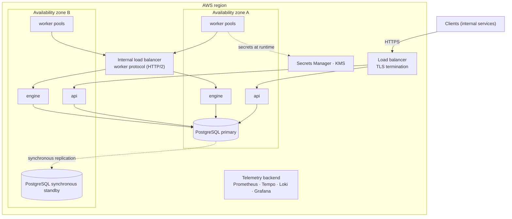

### 18.2 Components

| Component | Deployment | Notes |
|---|---|---|
| Load balancer | Managed (ALB) with TLS termination | Internal-facing, since clients are internal services |
| `api` | ≥ 2 containers across AZs | Autoscales on CPU and request rate |
| `engine` | ≥ 2 containers across AZs | Reached by workers through an internal load balancer that supports long-lived HTTP/2 streams; redirects workers to pool owners |
| Workers | One service per pool, spread across AZs | Autoscale on backlog; drain on `SIGTERM` |
| PostgreSQL | Managed, Multi-AZ with synchronous standby | Automated backups, point-in-time recovery, encryption, parameters tuned for queue workloads |
| Secrets | AWS Secrets Manager and KMS | Injected at runtime, never baked into images |
| Images | ECR: one image for `api` / `engine` (selected by a role flag), one per worker pool | Scanned and signed in CI |
| Telemetry | OTel Collector, then a managed or self-hosted Prometheus/Grafana stack | Decided at Technology Selection |
| Infrastructure as code | Terraform for everything | Environments created and destroyed on demand |

### 18.3 Health checks

- **Liveness** checks only that the process is responsive. It does not check dependencies, which would cause restart storms during a database outage.
- **Readiness:** `api` needs a database connection. `engine` needs a database connection and a running worker-protocol server; it does not depend on owning a pool. A worker is ready once it holds a registered session.
- Startup probes cover slow starts.

### 18.4 Rolling deploys

- **`api`:** standard rolling update with connection draining.
- **`engine`:** one replica at a time. On `SIGTERM` it releases its leases explicitly, so ownership hands off at once rather than after the TTL, and its workers are redirected.
- **Workers:** on `SIGTERM` they drain (stop polling, finish within the grace period, release the rest) and then deregister. Each pool's grace period reflects its job durations.
- **Compatibility:** versions N and N−1 run side by side during a rollout. So:
  - database migrations follow expand/contract;
  - the worker protocol is versioned and backward compatible;
  - payload schemas evolve compatibly (R2).
- **Migrations** run as a separate step before the rollout, using a dedicated database role.
- **Rollback** redeploys the previous image. Migrations stay backward compatible for one version.

### 18.5 Autoscaling

- **Workers:** per pool, on `jobs_oldest_ready_age_seconds` and slot utilization. On EKS that means KEDA with a Prometheus scaler; on ECS, target tracking on a custom metric.
- **`api`:** CPU and request rate.
- **`engine`:** a small fixed count (2–3), increased as pools per node or dispatch rate per node grows.
- **Database:** manual vertical scaling, plus storage autoscaling.

### 18.6 Backups and disaster recovery

- **In region:** the synchronous standby gives RPO ≈ 0, and automatic failover takes minutes.
- **Backups:** automated snapshots plus point-in-time recovery (7–35 days of retention), with restore drills each release cycle.
- **Regional disaster:** restore from snapshots copied to another region. RPO is the snapshot or recovery lag and RTO is hours. This is a manual runbook in V1, not automated.
- Job types and schedules are data, so backups cover them. Infrastructure is Terraform, so it can be rebuilt.

### 18.7 Environments and cost

- Environments are created with Terraform and destroyed when idle.
- Minimum footprint: 2 `api` and 2 `engine` tasks, one worker pool, and the smallest Multi-AZ database class that passes the load test.
- No broker, cache or coordinator to pay for in V1.

### 18.8 Local development

`docker compose up` starts:
- PostgreSQL;
- the platform in all-in-one mode (`api` + `engine`);
- a demo worker pool with sample handlers (sleep, fail N times, simulated HTTP call);
- the observability stack from [§17.6](#176-local-stack).

If EKS is chosen, an optional kind or k3d profile will mirror the Kubernetes manifests.

## 19. Architecture alternatives

### 19.1 End-to-end architectures

| Alternative | Summary | Verdict |
|---|---|---|
| **Alt 1**: PostgreSQL queue, workers claim directly (Oban / River / Solid Queue style) | One source of truth and the fewest moving parts. But workers need database credentials and connections, priority and caps must live in each worker's SQL, and other executors or languages would need the claim protocol reimplemented. | Rejected. The roadmap would force a later migration of every worker to a protocol. |
| **Alt 2**: PostgreSQL queue + dispatcher + worker protocol (Temporal-style pull) | Same single source of truth. Connections scale with engines, policy lives in code, workers hold only worker credentials, and the protocol is the extension seam. | **Chosen.** |
| **Alt 3**: PostgreSQL state + message broker for dispatch (Celery style) | The broker handles delivery. But job state lives in two places and needs reconciliation, broker timeouts must match our leases, priority × tenant maps poorly onto queues, delays still need the database, and the throughput ceiling barely moves. | Rejected. |
| **Alt 4**: Partitioned schedulers + in-memory timing wheels + Kafka | Scales past 10⁵ jobs/s with ~100 ms precision, at the cost of rebalancing, timer reload on failover, Kafka operations and head-of-line blocking. | Deferred. It is the tier L target ([§15.6](#156-path-to-tier-l)). |

### 19.2 Comparison

| Criterion | Alt 1 | **Alt 2** | Alt 3 | Alt 4 |
|---|---|---|---|---|
| Where job state lives | DB | DB | DB + broker | DB + log + memory |
| Consistency risk | Low | Low | Medium–high | High |
| DB connections grow with | Workers | Engine replicas | Services | Varies |
| Priority and tenant caps | SQL, approximate | In memory, exact in steady state | Broker queue layout | Custom |
| Long-running jobs | Good | Good | Must match broker timeouts | Head-of-line risk |
| Workers need access to | DB | Worker credentials only | Broker | Broker |
| New executors and languages | Hard | Natural | Natural | Natural |
| V1 infrastructure | Postgres | Postgres | Postgres + broker | Sharded DB + Kafka + coordination |
| Operating cost | Lowest | Low | Medium | High |
| Fit for tier M | Good | Best | More than needed | More than needed |

### 19.3 Execution models

| Model | Verdict |
|---|---|
| Worker pull, direct from the DB | See Alt 1. |
| Worker pull through a dispatcher (long-poll) | **Chosen**: push-like latency with pull's natural backpressure. |
| Scheduler push | Rejected: needs accurate, fresh capacity data and handles slow or dead workers badly. |
| Broker-based | See Alt 3. |
| Container per job | Deferred: strongest isolation, but startup takes seconds to minutes and each job costs far more. It fits later as a worker pool whose handler launches containers. |

### 19.4 Component-level alternatives

| Topic | Options considered | Decision |
|---|---|---|
| Due-work detection | DB polling, time buckets, in-memory heap, timing wheel, broker delay | Indexed polling plus materialization lookahead ([ADR-001](decisions/ADR-001-scheduler-architecture.md)) |
| Scheduler coordination | Single leader, global DB lock, row claims, partitioned leases | Leaderless row claims plus unique constraints ([ADR-001](decisions/ADR-001-scheduler-architecture.md)) |
| Locking and fencing | Global lock, `SKIP LOCKED`, optimistic CAS, advisory locks, external lock service, DB leases | `SKIP LOCKED` + CAS + DB leases with epochs + attempt fencing tokens ([ADR-005](decisions/ADR-005-distributed-locking-and-fencing.md)) |
| Leader election | Global leader, Kubernetes Lease, etcd/ZooKeeper, embedded Raft, scoped DB leases | No leader for correctness; scoped DB leases ([ADR-006](decisions/ADR-006-leader-election.md)) |
| Message broker | None, RabbitMQ, SQS/SNS, Kafka, Redis Streams | None in V1; outbox when a consumer exists ([ADR-003](decisions/ADR-003-message-broker.md)) |
| Database | PostgreSQL, MySQL, distributed SQL, DynamoDB | PostgreSQL ([ADR-004](decisions/ADR-004-database.md)) |
| Cache / coordination store | Redis, etcd, ZooKeeper, in-process caches, DB | No Redis in V1 ([ADR-011](decisions/ADR-011-caching-and-redis.md)) |
| Service topology | Microservices, single process, modular monolith with roles | Modular monolith with roles ([ADR-009](decisions/ADR-009-modular-monolith.md)) |

## 20. Trade-offs

| Decision | We gain | We give up | Revisit when |
|---|---|---|---|
| PostgreSQL as the queue, no broker | One source of truth; transactional state changes; minimal infrastructure | A single-primary write ceiling; vacuum and bloat tuning | Sustained write saturation |
| Dispatcher tier with a worker protocol | Central policy, a security boundary, an extension seam | An extra hop, an HA component, more code | Not expected; it is the seam everything else extends |
| No leader election for correctness | Split brain can't corrupt state | Leases are still needed for ownership | n/a |
| Leases in PostgreSQL | Fencing that is atomic with the data | Coordination depends on the database, which is already the source of truth | Sharding or multi-region |
| Polling for due work | Simple, stateless, trivial failover | ~250 ms granularity; a constant small query load | Precision needs of ~100 ms |
| At-least-once execution | Achievable and honest | Handlers must be idempotent | Never: exactly-once side effects are impossible in general |
| Modular monolith with roles | Simple deploys; boundaries that can be refactored | A shared release cadence and database | Team or scale growth |
| No broker or Redis in V1 | Lower cost and fewer operations | Must be added for external consumers or exact global limits | The first external consumer |
| Single region | Much simpler | A regional outage means downtime | Availability > 99.95% or residency rules |
| Weighted priority + caps instead of full fair share | Simple, predictable | Cross-tenant fairness is approximate | Tenants' SLOs missed under contention |
| Registered handlers only | Security and simplicity | Less flexibility | Demand for arbitrary workloads (container executor) |

---

## Appendix A — Extension points

| Future capability | Extension point | Core change needed |
|---|---|---|
| DAG workflows | `WorkflowRun` entity and `job_dependencies`; the completion transaction decrements pending-dependency counts and releases children to `READY` | New module; dispatch unchanged |
| Event-triggered jobs | New trigger type plus an inbound adapter (webhook endpoint or broker consumer) that creates jobs | New trigger and adapter |
| Completion webhooks | An outbox consumer | Outbox, relay and broker |
| HTTP executor | A worker pool whose handler makes outbound HTTP calls (with SSRF controls) | None |
| Container / Kubernetes Jobs | A worker pool whose handler launches and monitors containers | None |
| Serverless executors | A worker pool that invokes functions | None |
| GPU / resource-aware scheduling | Worker capacity labels plus job resource requests; bin-packing in the dispatcher's selection step | Dispatcher only |
| Weighted fair share | Deficit round-robin across tenants in the dispatcher's selection step | Dispatcher only |
| Per-key concurrency and rate limits | Key counters in the dispatcher's selection step | Dispatcher only |
| New due-work strategy (for example, a timing wheel) | `DueWorkSource` port | Engine only |
| New queue or storage backend | Repository ports | New adapter |
| Batch and data pipelines | Workflows plus payloads passed by reference | Depends on workflows |
| Geographic scheduling | Pools per region plus region labels | Multi-region (major) |

## Appendix B — ADR index

| ADR | Title | Status |
|---|---|---|
| [ADR-001](decisions/ADR-001-scheduler-architecture.md) | Scheduler architecture | Accepted |
| [ADR-002](decisions/ADR-002-worker-pull-via-dispatcher.md) | Worker pull via dispatcher | Accepted |
| [ADR-003](decisions/ADR-003-message-broker.md) | Message broker | Accepted |
| [ADR-004](decisions/ADR-004-database.md) | Database | Accepted |
| [ADR-005](decisions/ADR-005-distributed-locking-and-fencing.md) | Distributed locking and fencing | Accepted |
| [ADR-006](decisions/ADR-006-leader-election.md) | Leader election | Accepted |
| [ADR-007](decisions/ADR-007-execution-semantics.md) | Job execution semantics | Accepted |
| [ADR-008](decisions/ADR-008-retry-strategy.md) | Retry strategy | Accepted |
| [ADR-009](decisions/ADR-009-modular-monolith.md) | Modular monolith vs microservices | Accepted |
| [ADR-010](decisions/ADR-010-deployment-strategy.md) | Deployment strategy | Accepted in part (runtime pending) |
| [ADR-011](decisions/ADR-011-caching-and-redis.md) | Caching and Redis | Accepted |
| [ADR-012](decisions/ADR-012-language-and-core-libraries.md) | Language and core libraries | Accepted; amended by ADR-013 and ADR-014 |
| [ADR-013](decisions/ADR-013-cron-evaluation.md) | Cron evaluation with explicit DST rules | Accepted |
| [ADR-014](decisions/ADR-014-worker-protocol.md) | Worker protocol: unary calls, long-poll and owner redirects | Accepted |
| [ADR-015](decisions/ADR-015-releasing-undelivered-assignments.md) | Releasing assignments that were never delivered | Accepted |
| [ADR-016](decisions/ADR-016-withdrawing-provisional-schedule-jobs.md) | Schedule changes withdraw provisional jobs by deleting them | Accepted |
| [ADR-017](decisions/ADR-017-platform-administration.md) | Platform administration: platform-admin role, dispatch holds and worker drain | Accepted |
| [ADR-018](decisions/ADR-018-quotas-and-load-shedding.md) | Tenant quotas and priority-aware load shedding | Accepted |
| [ADR-019](decisions/ADR-019-payload-json-schema.md) | Payload validation with JSON Schema | Accepted |
| [ADR-020](decisions/ADR-020-telemetry.md) | Telemetry: pulled metrics, linked attempt traces, owner-reported pool gauges | Accepted |

## Appendix C — Open questions for the LLD

Resolved questions link to their answer.

1. Keep the promotion step, or let the dispatcher claim due jobs directly? A separate ready table, or a state column only? → [LLD §8.1](low-level-design.md#81-storage-layout)
2. Exact schema: partition granularity, indexes, fillfactor and HOT-update strategy. → [LLD §8.1](low-level-design.md#81-storage-layout)
3. Attempt storage: current-attempt columns on the job plus history rows, or attempt rows only? → [LLD §8.1](low-level-design.md#81-storage-layout)
4. Store payloads in a separate table with shorter retention than job metadata? → [LLD §8.1](low-level-design.md#81-storage-layout)
5. Adopt PostgreSQL row-level security as a second tenant-isolation layer? → [LLD §8.1](low-level-design.md#81-storage-layout), revisited in phase 12
6. Concurrent duplicate `Idempotency-Key` requests: wait and replay, or return `409` immediately? → [LLD §8.4](low-level-design.md#84-idempotency)
7. Worker protocol: transport (gRPC or HTTP/2), message schemas and versioning rules. → [ADR-014](decisions/ADR-014-worker-protocol.md)
8. How pool-owner redirects work, and how workers reconnect and back off. → [ADR-014](decisions/ADR-014-worker-protocol.md)
9. Dispatcher weighted round-robin details, and how tenant-cap counts are rebuilt after an ownership change. → [LLD §12.3](low-level-design.md#123-dispatcher)
10. Semantics of the "buffer one" and "cancel previous" overlap policies. → [LLD §10.4](low-level-design.md#104-promoter-and-overlap-policies)
11. When a schedule is paused, edited or deleted: delete or mark its withdrawn materialized jobs? → [ADR-016](decisions/ADR-016-withdrawing-provisional-schedule-jobs.md)
12. API error model, full contracts and the OpenAPI specification. → [LLD §9](low-level-design.md#9-job-api), [OpenAPI](../api/openapi.yaml)
13. Final lease, heartbeat and timeout values, validated by failure tests. *Open until phase 10.*
14. How per-node rate limits adjust as `api` replicas autoscale. → [LLD §9.6](low-level-design.md#96-admission-control-phase-4-part)

## Appendix D — Glossary

| Term | Meaning |
|---|---|
| Attempt | One try at running a job, by one worker, under one lease. |
| Dead-lettered | Terminal failure after retries are exhausted; can be re-driven by an operator. |
| Dedupe key | A business-level key: while a job with this key is active, submitting another returns the existing job. |
| Epoch | A counter incremented each time a lease changes hands; checked alongside the owner's writes. |
| Fencing token | A per-job counter incremented for every attempt; reports carrying an old token are rejected. |
| Idempotency key | A client-supplied key that makes retrying an API request safe. |
| Lease | Time-limited ownership that must be renewed, expiring on the database clock. |
| Materialize | Turn a schedule's upcoming fire times into job rows ahead of time. |
| Misfire | A fire time missed because the system was down or behind. |
| Overlap policy | What happens when a schedule's next run is due while the previous run is still active. |
| Pool | A group of workers serving a set of job types; the unit of dispatcher ownership. |
| Promote | Move a due job from `SCHEDULED` or `RETRY_PENDING` to `READY`. |
| Reaper | The engine loop that expires dead worker sessions and enforces deadlines. |
| Self-fencing | A worker or owner stopping its own work once it can no longer renew its lease. |
| Session | A registered worker's connection lifetime, kept alive by heartbeats. |
| Tier M / tier L | The design workload (10–50M jobs/day) and the larger future workload (100M–1B jobs/day). |
